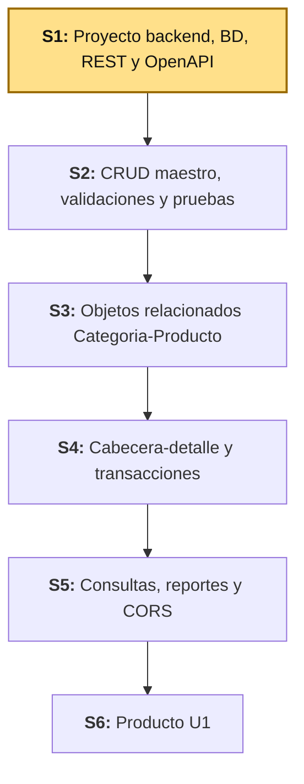
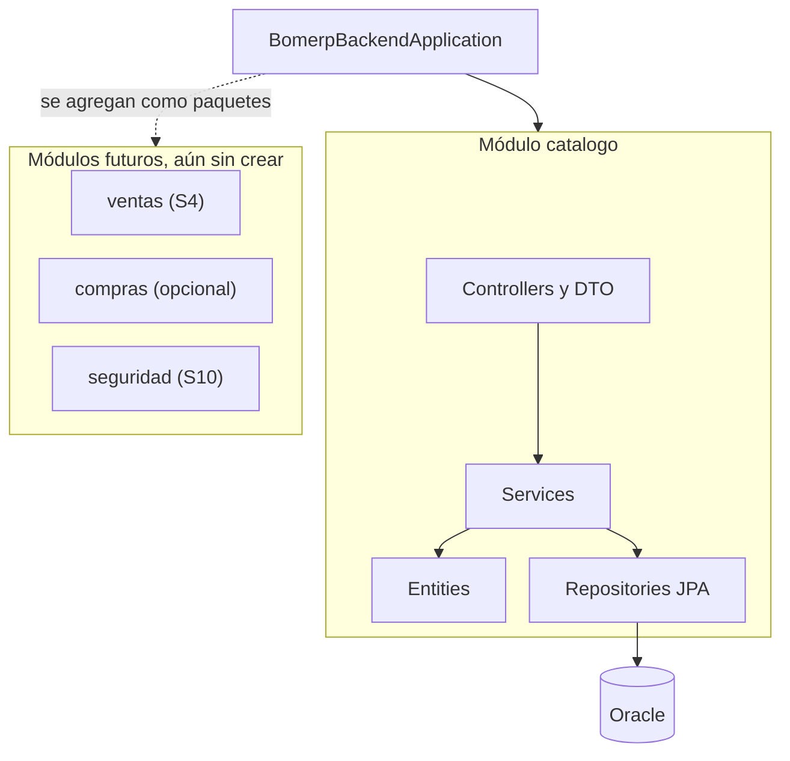
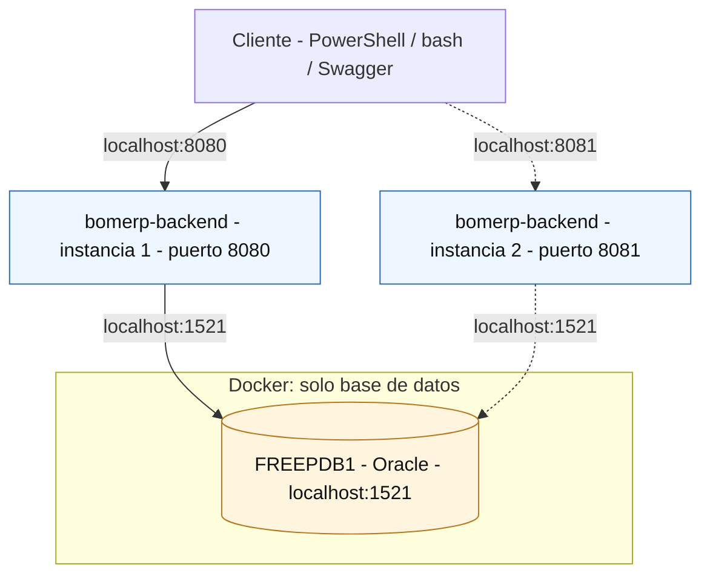

# S1 - Arquitectura Backend REST Profesional

*Por: Angel Sullon Macalupu @asullom - 2026*

## 1. Introducción

Tiempo: 20 min.

### 1.1 Presentación de la sesión

La arquitectura de un backend decide qué tan fácil es mantenerlo y hacerlo crecer sin romperse. Esta sesión instala Java 21, crea el proyecto backend como monolito modular conectado a Oracle, y define su contrato REST inicial (`Categoria`, `Producto`, versionado, OpenAPI).

### 1.2 Índice

1. Estructura del proyecto backend y dependencias.
2. Configuración por ambientes, ORM, driver y conexión a Oracle.
3. Endpoint de verificación, recurso REST inicial y DTO.
4. Contrato, versionado básico de API y documentación OpenAPI.

### 1.3 Propósito de aprendizaje

Al concluir la clase, estarás en condiciones de:

- **Crear y entregar** un proyecto backend ejecutable y reproducible, sobre Java 21 LTS, con conexión a Oracle verificada mediante ORM, endpoint de salud, listado de `Categoria` (`Producto`, opcional), módulos de negocio, DTO de salida, contrato y versionado básico de API, y documentación OpenAPI inicial.

### 1.4 Producto de sesión

Proyecto backend ejecutable y reproducible, sobre Java 21 LTS, organizado como monolito modular y conectado a Oracle con su conexión verificada mediante ORM, con endpoint de salud, contrato y versionado básico de API definidos, y el listado de `Categoria` documentado mediante OpenAPI. De forma opcional, también el listado de `Producto` (su CRUD completo se construye en S2).

### 1.5 Metodología

**Tabla 1. Metodología de la sesión**

| Actividades a Realizar en el Periodo | Orientaciones generales (Orientaciones Metodológicas) | Material de estudio recomendado |
|---|---|---|
| Revisión previa individual | Instalar y verificar Java 21 LTS, VS Code y sus extensiones; leer [ADR-001](../adr/ADR-001-arquitectura-backend.md) y [ADR-002](../adr/ADR-002-spring-modulith.md). Trabajo individual, antes de clase; traer evidencia de `java -version` funcionando. | ADR-001, ADR-002, guía de instalación Java 21. |
| Clase presencial | Explicación guiada de conceptos (REST, DTO, versionado, ambientes) y creación del proyecto backend conectado a Oracle; delimitación de los endpoints del módulo `catalogo`. Trabajo individual en la propia laptop, siguiendo al docente paso a paso; consulta inmediata ante errores de dependencias o conexión. `Producto` (3.4.2) es alcance opcional: no es necesario completarlo para cerrar la sesión, su CRUD completo se construye en S2. | `pom.xml` de referencia, `application-dev.yml`, Docker Compose de Oracle, cliente REST para verificar endpoints. |
| Evaluación formativa | Verificación en clase de `mvn test` (incluye `ModularityTests`) y de la respuesta del endpoint de salud y los listados; inicio de la evidencia individual. La evidencia se completa y sustenta de forma individual, fuera del aula, según los criterios mínimos de la sección 4.4. | Indicaciones de entrega (4.3), rúbrica de evaluación (4.6). |

### 1.6 Motivación de la sesión

#### 1.6.1 Caso: catálogo de BomERP (`Categoria`–`Producto`)

Antes de escribir el primer endpoint, hay algo más urgente que resolver: ¿este backend arranca de forma reproducible y realmente conecta a Oracle, o solo "funciona en mi máquina"? Esa pregunta no es solo de LP2 — **BomERP** (*Business Operations Management – Enterprise Resource Planning*), el proyecto integrador evolutivo de ADS, BD2 y LP2 en este ciclo, depende de que esta base funcione: ADS define en paralelo, en su propia S1, la primera visión arquitectónica del sistema (monolito modular verificado con Spring Modulith), y BD2 crea el esquema `BOM_CATALOGO` sobre el que este backend se conecta. Si el backend no arranca de forma confiable, ninguna de esas dos decisiones tiene dónde apoyarse. Esta sesión construye esa primera pieza concreta: la base backend que arranca de forma reproducible, comprueba su conexión a Oracle y expone los listados iniciales del módulo `catalogo`: `Categoria` y `Producto`.

**Preguntas de análisis**

**Activación de conocimientos previos**

1. ¿Qué decisión de ADS condiciona la estructura del backend?
2. ¿Cómo se evidencia que este backend no es un proyecto aislado, sino la capa que expone las decisiones de ADS y los datos que crea BD2?

**Comprensión de arquitectura backend**

1. ¿Por qué `Categoria` y `Producto` pertenecen al mismo módulo de catálogo?
2. ¿Qué diferencia existe entre una entidad y su DTO de respuesta?
3. ¿Cómo demuestran los listados que Controller, Service, Repository y Oracle están conectados?

### 1.7 Ubicación en el curso

- Unidad: U1 - Backend REST empresarial.
- Producto del curso: base Full-Stack modular de BomERP, integrada, optimizada, monitoreada, estabilizada y preparada académicamente para producción.
- Producto de unidad: backend REST empresarial conectado a la base de datos, con CRUD, transacciones, consultas, reglas de negocio, CORS, logs y pruebas.
- Avance del producto en esta sesión: proyecto backend creado, configurado, conectado y verificable.

Roadmap del producto de la unidad:

**Figura 1. Roadmap del producto de la unidad**



## 2. Explica

Tiempo: 25 min.

### 2.1 Arquitectura de la sesión

**Figura 2. Arquitectura del módulo `catalogo` en el backend BomERP**



Lectura del diagrama:

- Organización: primero por módulo de negocio, luego por capa (controller, service, repository, entity).
- `Categoria`/`Producto` → `catalogo`; `Venta–DetalleVenta` → `ventas`; `Compra–DetalleCompra` → `compras`.
- Un módulo no accede al repositorio de otro: solo mediante servicios públicos.
- Integración (no exigida en S1): ADS diseña esos componentes; BD2 aporta los objetos que el backend consume.

Este diagrama es el mapa que guía el resto de la explicación, en el mismo orden del Índice (1.2).

### 2.2 Estructura del proyecto backend y dependencias

El proyecto se organiza como monolito modular: un único paquete raíz (`BomerpBackendApplication`) y, dentro de él, un paquete por módulo de negocio (ver 2.1). Esa estructura se sostiene únicamente sobre las dependencias que la sesión necesita:

**Tabla 2. Dependencias del proyecto backend**

| Dependencia | Decisión para S1 |
|---|---|
| Spring Web | Se conserva para publicar el recurso REST. |
| Spring Data JPA y driver Oracle | Se conservan para dejar lista y comprobar la persistencia ORM. |
| Validation | Se incorpora al esqueleto; se aplica al CRUD desde S2. |
| Actuator | Se conserva para verificar aplicación y conexión. |
| Springdoc OpenAPI | Se conserva para publicar el contrato inicial. |
| DevTools | Se agrega para reinicio automático y LiveReload durante el desarrollo; Spring Boot la excluye automáticamente del `.jar` empaquetado, así que no afecta producción. |
| Security y OAuth2 Resource Server | Se posponen hasta S10 — ver [ADR-004](../adr/ADR-004-jwt-diferido.md). |


### 2.3 Configuración por ambientes, ORM, driver y conexión a Oracle

Un **ambiente** es el conjunto de configuración (variables, credenciales,
infraestructura) que corresponde a un contexto de uso concreto: **DEV**
(tu laptop, para desarrollar) y **producción** (el sistema real ya en
funcionamiento) son dos ambientes distintos; algunos proyectos agregan
ambientes intermedios (pruebas o QA, staging).

En BomERP, definimos el **ambiente DEV** identificado con el
sufijo `-dev`:

- `application-dev.yml`: configuración de Spring Boot para tu laptop, incluida la conexión ORM/JPA y el driver Oracle hacia `localhost`.
- `compose-dev.yml`: el contenedor Docker de Oracle para DEV.

El ambiente de **producción** (`application-prod.yml` y las decisiones de
despliegue) se incorpora recién en S13, cuando el sílabo trata
"buenas prácticas de despliegue" — no se adelanta antes porque todavía no
hay nada real que desplegar.

### 2.4 Endpoint de verificación, recurso REST inicial y DTO

REST permite organizar un backend alrededor de recursos, métodos HTTP y representaciones. Cada método HTTP tiene un propósito definido sobre un recurso:

**Tabla 3. Métodos HTTP y su propósito**

| Método | Para qué sirve |
|---|---|
| `GET` | Consultar o listar un recurso, sin modificarlo. |
| `POST` | Crear un nuevo recurso. |
| `PUT` | Actualizar/reemplazar por completo un recurso existente. |
| `DELETE` | Eliminar un recurso. |

El endpoint de verificación (Actuator) confirma que la aplicación arrancó y está conectada a Oracle; el recurso REST inicial (`Categoria`, `Producto`) expone los primeros listados del módulo `catalogo`, y el DTO de salida separa ese contrato de la entidad persistida — la API responde lo que el cliente necesita, no la tabla tal cual.

### 2.5 Contrato, versionado básico de API y documentación OpenAPI

En un sistema empresarial, el contrato de API debe ser claro porque luego será consumido por una SPA y deberá estar conectado con persistencia, seguridad, transacciones y reglas del negocio.

**Versionado básico de API**: BomERP versiona su contrato en la propia URL (`/api/v1/...`). Es la forma más simple de versionado: si en el futuro un cambio rompe compatibilidad, se publica `/api/v2/...` sin obligar a los consumidores existentes (la SPA desde S7, o cualquier integración externa) a migrar de inmediato. En S1 basta con fijar el prefijo `v1`; no se implementa todavía coexistencia de versiones.

**Error frecuente**: dejar el contrato sin códigos de error documentados. Un contrato verificable incluye 400, 401, 404, 409 y 500, no solo el camino feliz.

Springdoc OpenAPI (ver 2.2) publica este contrato como documentación viva y siempre sincronizada con el código; la trazabilidad entre API, base de datos y arquitectura se verifica contra esa documentación, no contra un documento aparte.

## 3. Aplica: actividad práctica guiada

Tiempo: 2h.

**Actividad:** creación guiada del proyecto backend `bomerp-backend`, conectado a Oracle, con los listados iniciales de `Categoria` y `Producto` (Producto de la sesión en 1.4).

**Propósito de la actividad:** construir el proyecto backend de punta a punta — desde el Spring Initializr hasta los listados de `Categoria` y `Producto` ejecutando conectados a Oracle, con contrato REST y documentación OpenAPI inicial — verificando cada incremento antes de continuar al siguiente.

**Orientaciones metodológicas:** en el laboratorio, el docente guía la creación del proyecto backend paso a paso frente a la clase, y los estudiantes replican cada paso en su propia laptop, verificando el resultado con `mvn test` y las consultas REST antes de avanzar al siguiente paso.

**Actividades para realizar:**

- **3.1** Instalar y verificar Java 21 LTS, VS Code y sus extensiones.
- **3.2** Crear el proyecto Spring Boot con las dependencias base y conexión a la base de datos.
    - **3.2.1** Crear el proyecto con Spring Initializr desde VS Code.
    - **3.2.2** Ejecutar una primera vez y reconocer el fallo esperado.
    - **3.2.3** Configurar el ambiente de desarrollo (dev).
    - **3.2.4** Ejecutar y comprobar que ya no falla.
    - **3.2.5** Configurar OpenAPI.
    - **3.2.6** Crear un endpoint temporal de "Hola mundo".
- **3.3** Simular escalamiento horizontal (múltiples instancias).
- **3.4** Implementar el módulo `catalogo`: `Categoria` y `Producto`.
    - **3.4.1** Construir `Categoria`.
    - **3.4.2** Construir `Producto` (opcional).
    - **3.4.3** Ejecutar y probar el backend.
    - **3.4.4** Verificar la estructura modular con Spring Modulith.
- **3.5** Delimitar los endpoints del módulo Catálogo.
- **3.6** Reconocer el DTO de entrada reservado para S2.
- **3.7** Diseñar DTO de salida.
- **3.8** Documentar errores.
- **3.9** Bosquejar estructura del backend modular (Spring Modulith).
- **3.10** Trazar LP2 con ADS y BD2.

### 3.1 Instalar y verificar Java 21 LTS, VS Code y sus extensiones

**Producto del paso:** entorno de desarrollo configurado con Java 21.

**Windows** — **PowerShell** como usuario normal:

```powershell
winget install --id EclipseAdoptium.Temurin.21.JDK --exact
```

**macOS** (Homebrew no viene preinstalado en ningún Mac; una vez instalado,
el comando de Temurin es el mismo para Intel y para Apple Silicon
M1/M2/M3/M4 — Homebrew detecta la arquitectura automáticamente):

```bash
# 1. Instalar Homebrew (si no lo tiene)
/bin/bash -c "$(curl -fsSL https://raw.githubusercontent.com/Homebrew/install/HEAD/install.sh)"

# 2. Solo en Apple Silicon (M1/M2/M3/M4): agregar Homebrew al PATH.
#    Se instala en /opt/homebrew (no en /usr/local como en Intel), y el
#    propio instalador lo pide como paso obligatorio, no opcional.
echo 'eval "$(/opt/homebrew/bin/brew shellenv)"' >> ~/.zprofile
eval "$(/opt/homebrew/bin/brew shellenv)"

# 3. Instalar Temurin 21
brew install --cask temurin@21
```

**Linux (Ubuntu/Debian)** — repositorio oficial de Adoptium vía `apt`:

```bash
sudo apt install -y wget apt-transport-https gpg
wget -qO - https://packages.adoptium.net/artifactory/api/gpg/key/public | gpg --dearmor | sudo tee /etc/apt/trusted.gpg.d/adoptium.gpg > /dev/null
echo "deb https://packages.adoptium.net/artifactory/deb $(awk -F= '/^VERSION_CODENAME/{print$2}' /etc/os-release) main" | sudo tee /etc/apt/sources.list.d/adoptium.list
sudo apt update
sudo apt install -y temurin-21-jdk
```

**Linux (Fedora/RHEL)** — repositorio oficial de Adoptium vía `dnf`:

```bash
sudo tee /etc/yum.repos.d/adoptium.repo > /dev/null <<'EOF'
[Adoptium]
name=Adoptium
baseurl=https://packages.adoptium.net/artifactory/rpm/$(. /etc/os-release; echo $ID)/$releasever/$basearch
enabled=1
gpgcheck=1
gpgkey=https://packages.adoptium.net/artifactory/api/gpg/key/public
EOF
sudo dnf install -y temurin-21-jdk
```

Al finalizar, cierre y vuelva a abrir la terminal. Verifique la instalación:

```powershell
java --version
javac --version
```

**NOTA:** Ambas comprobaciones deben mostrar Java 21. Si conserva una versión anterior, configure `JAVA_HOME` con la ruta del JDK 21 desde las variables de entorno de Windows, actualice `Path` para que `%JAVA_HOME%\bin` tenga prioridad y abra una terminal nueva.

#### 3.1.1 Instalar VS Code y extensiones

**Producto del paso:** VS Code instalado con las extensiones necesarias para el resto de la sesión.

El curso usa **VS Code** como editor por defecto.

**Windows** `PS`:

```powershell
winget install -e --id Microsoft.VisualStudioCode
```

**macOS** :

```bash
brew install --cask visual-studio-code
```

**Linux (Ubuntu/Debian)** :

```bash
sudo snap install --classic code
```

En cualquier sistema también puede descargarse el instalador desde <https://code.visualstudio.com/download>.

Al finalizar, instala las extensiones desde la terminal:

```bash
code --install-extension vscjava.vscode-java-pack
code --install-extension vmware.vscode-boot-dev-pack
```
```bash
code --install-extension cweijan.vscode-database-client2
```
```bash
code --install-extension Oracle.sql-developer
```

**Tabla 4. Extensiones de VS Code requeridas**

| Extensión | ID | Para qué sirve |
|---|---|---|
| Extension Pack for Java | `vscjava.vscode-java-pack` | Soporte base de Java (autocompletado, debug, Maven); incluye Spring Initializr Java Support, usado en 3.2.1. |
| Spring Boot Extension Pack | `vmware.vscode-boot-dev-pack` | Herramientas específicas de Spring Boot: navegación de beans, Spring Boot Dashboard, soporte de `application.yml`. |
| Database Client | `cweijan.vscode-database-client2` | Cliente gráfico multi-motor: MySQL, PostgreSQL, SQLite, SQL Server, Oracle, entre otros. |
| Oracle SQL Developer for VS Code | `Oracle.sql-developer` | Extensión oficial de Oracle, gratuita, para conectarse a la Oracle de este proyecto (ver 3.2.3). |

!!! tip "Si instalaste todo pero `Ctrl+Shift+P` → \"Spring\" no muestra ningún comando"
    El Spring Boot Extension Pack puede quedar **instalado pero deshabilitado**. Reiniciar VS Code (o toda la PC) no lo arregla si quedó en ese estado.

    Verifica en el panel de extensiones (`Ctrl+Shift+X`, buscar "Spring"): si el botón dice **Enable** en vez de **Disable**, está deshabilitado — actívalo. Recién ahí aparecen los comandos de Spring en la paleta de comandos.

### 3.2 Crear el proyecto Spring Boot con las dependencias base y conexión a la base de datos

**Producto del paso:** proyecto `bomerp-backend` ejecutable y conectado a Oracle.

#### 3.2.1 Crear el proyecto con Spring Initializr desde VS Code

Usa la extensión **Spring Initializr Java Support** (`vscjava.vscode-spring-initializr`), incluida en el Extension Pack for Java instalado en 3.1.1.

Desde la raíz del monorepo `bomerp-backend`, abre VS Code y abre la **paleta de comandos de vscode**:

- Windows/Linux: `Ctrl+Shift+P`
- macOS: `Cmd+Shift+P`

(No es `Ctrl+P` — ese atajo abre "Ir a archivo", un comando distinto.)

Escribe `Spring Initializr` y selecciona:

```text
Spring Initializr: Create a Maven Project
```

Usa la siguiente configuración:

**Tabla 5. Configuración del proyecto en Spring Initializr**

| Campo | Valor |
|---|---|
| Project | Maven Project |
| Spring Boot | **4.0.7** |
| Language | Java |
| Group Id | `pe.edu.upeu` |
| Artifact Id | `bomerp-backend` |
| Package name | `pe.edu.upeu.bomerp` |
| Packaging | Jar |
| Java | 21 |
| Dependencias | Seleccionar dependencias del proyecto |
| Ubicación | carpeta donde haces clic en "Generate into this folder", deja vacío |

**Por qué 4.0.7 y no otra versión.** Verificado directo en [start.spring.io](https://start.spring.io/) (con `4.1.0` seleccionado, el propio buscador de dependencias muestra en rojo, al escribir "springd": *"Requires Spring Boot >= 4.0.0 and < 4.1.0-M1"*). 

Dependencias a seleccionar:

**Tabla 6. Dependencias seleccionadas en Spring Initializr**

| Grupo | Dependencias | Propósito |
|---|---|---|
| API REST base | Spring Web, Validation | Exponer endpoints HTTP y validar entradas |
| Persistencia | Spring Data JPA, Oracle Driver | Acceso a datos y conexión a Oracle |
| Documentación y operación | SpringDoc OpenAPI, Spring Boot Actuator | Documentar la API con Swagger y verificar salud |
| Arquitectura modular | Spring Modulith | Verificar y documentar los límites entre módulos de negocio (ver ADR-002) |
| Productividad | Lombok, Spring Boot DevTools | Reducir código repetitivo y reiniciar automáticamente al guardar cambios |

Referencia visual (selección real en VS Code con Spring Boot 4.0.7, las 9 dependencias de la tabla):

**Figura 3. Selección de dependencias en Spring Initializr (1/2)**


**Figura 4. Selección de dependencias en Spring Initializr (2/2)**


Antes de presionar `Enter` para continuar, la lista debe mostrar exactamente:

```text
Selected 9 dependencies
✓ Spring Web
✓ Validation
✓ Spring Data JPA
✓ Oracle Driver
✓ SpringDoc OpenAPI
✓ Spring Boot Actuator
✓ Spring Modulith
✓ Lombok
✓ Spring Boot DevTools
```

Después de `Enter`, el asistente pide dónde guardar el proyecto. Navega hasta la carpeta y da clic en **"Generate into this folder"** — no escribas nada en el campo "Carpeta":

**Figura 5. Selector de carpeta de VS Code para generar el proyecto**


**Sobre dónde queda el proyecto.** Se crea dentro de la carpeta donde diste clic en "Generate into this folder", una **subcarpeta nueva con el nombre del Artifact Id**. Da clic estando parado en `lp2/`: el proyecto queda en `lp2/bomerp-backend/`, que es exactamente la carpeta que usa el resto de esta guía — no hace falta renombrar nada.

!!! danger "Paso obligatorio: elimina `spring-modulith-starter-jpa` del `pom.xml`"
    El Initializr agrega automáticamente `spring-modulith-starter-jpa`
    (scope `compile`) porque también seleccionaste Spring Data JPA. **Ábrelo
    y bórralo del `pom.xml` ahora mismo, antes de continuar** — si lo dejas,
    el proyecto no arranca.

    Por qué: esa dependencia trae el registro de eventos de Modulith
    respaldado por JPA, que exige su propia tabla (`event_publication`).
    Como los módulos de esta ADR se comunican por servicios Java, no por
    eventos, esa tabla no se usa — y con `ddl-auto: validate` (3.2.3),
    Hibernate falla al arrancar porque la tabla no existe en Oracle
    (`Schema-validation: missing table [event_publication]`). Detalle
    completo: [ADR-002](../adr/ADR-002-spring-modulith.md).

!!! danger "Paso obligatorio: elimina también `spring-modulith-observability` del `pom.xml`"
    El Initializr también agrega `spring-modulith-observability` (scope
    `runtime`) al seleccionar Spring Modulith. **Bórrala del `pom.xml`
    ahora mismo, junto con la anterior** — si la dejas, el proyecto arranca
    hasta que creas el primer `Filter` (`CorrelationIdFilter`, S2 3.2.2), y
    ahí falla con un `NullPointerException` confuso:

    ```text
    WARN  o.s.aop.framework.CglibAopProxy - Unable to proxy interface-implementing
    method [...GenericFilterBean.init...] because it is marked as final
    ERROR o.a.c.c.C.[Tomcat].[localhost].[/] - Exception starting filter [correlationIdFilter]
    java.lang.NullPointerException: Cannot invoke "...Log.isDebugEnabled()" because "this.logger" is null
    ```

    Por qué: esta dependencia agrega instrumentación automática con
    Micrometer sobre los beans de Spring, vía proxy AOP (CGLIB). Un
    `Filter` no debería proxiarse así — `GenericFilterBean.init()` es
    `final`, CGLIB no puede sobreescribirlo, y termina creando un proxy que
    se salta el constructor real (y con él, la inicialización del campo
    `logger`). No es un error en tu `CorrelationIdFilter.java` — es esta
    dependencia peleándose con cualquier `Filter` del proyecto. No la pide
    la lista de 9 dependencias de esta guía y no aporta nada para lo que
    S1 necesita (solo agrega métricas/trazas, no verificación de módulos —
    esa la sigue haciendo `spring-modulith-starter-core`, que si se queda).

    Verifica que quedó eliminada buscando `spring-modulith-starter-jpa` en
    el `pom.xml`: la búsqueda no debe encontrar ninguna coincidencia.

El Initializr deriva el nombre de la clase `@SpringBootApplication` del Artifact Id, así que la genera como `BomerpBackendApplication.java` — se mantiene ese nombre por defecto, sin renombrar (mismo paquete raíz `pe.edu.upeu.bomerp`):

```java
package pe.edu.upeu.bomerp;

import org.springframework.boot.SpringApplication;
import org.springframework.boot.autoconfigure.SpringBootApplication;

@SpringBootApplication
public class BomerpBackendApplication {

    public static void main(String[] args) {
        SpringApplication.run(BomerpBackendApplication.class, args);
    }
}
```

#### 3.2.2 Ejecutar una primera vez y reconocer el fallo esperado

**Producto del paso:** confirmar, de primera mano, que el proyecto necesita una base de datos configurada para arrancar.

Con `Spring Data JPA` y `Oracle Driver` ya en el `pom.xml` (3.2.1) pero sin ninguna conexión configurada todavía, ejecuta el proyecto tal cual:

```powershell
# Windows (PowerShell o cmd)
.\mvnw.cmd spring-boot:run
```

```bash
# macOS / Linux
./mvnw spring-boot:run
```

El arranque falla:

```text
***************************
APPLICATION FAILED TO START
***************************

Description:

Failed to configure a DataSource: 'url' attribute is not specified and no embedded datasource could be configured.

Reason: Failed to determine a suitable driver class
```

Es el fallo esperado: Spring Boot detectó `Spring Data JPA` + el driver de Oracle en el classpath y trató de autoconfigurar una conexión, pero no hay `url`, usuario ni contraseña en ningún lado todavía. No se corrige quitando JPA ni usando una base embebida — se corrige levantando Oracle y declarando la conexión real, en el paso siguiente.

#### 3.2.3 Configurar el ambiente de desarrollo (dev)

**Producto del paso:** ambiente de desarrollo (dev) completo — Oracle en Docker (con el esquema de BD2 cargado) y la aplicación configurada para conectarse a él.

Crea `compose-dev.yml` en la raíz de `lp2/bomerp-backend` — levanta **únicamente** Oracle, para tu laptop, con las credenciales en texto plano que también usará `application-dev.yml` en el paso siguiente (mismo criterio: sin `.env`):

```yaml
name: bomerp-backend-dev

services:
  oracle:
    image: gvenzl/oracle-free:23-slim
    container_name: bomerp-oracle
    restart: unless-stopped
    ports:
      - "1521:1521"
    environment:
      ORACLE_PASSWORD: 123456
      APP_USER: BOMERP_APP
      APP_USER_PASSWORD: 123456
    volumes:
      - oracle-data:/opt/oracle/oradata
    healthcheck:
      test: ["CMD", "healthcheck.sh"]
      interval: 10s
      timeout: 5s
      retries: 10
      start_period: 60s

volumes:
  oracle-data:
```

`ORACLE_PASSWORD` es la contraseña del usuario administrador (`SYS`/`SYSTEM`, el equivalente a `root`) — no lo usa el backend. `APP_USER`/`APP_USER_PASSWORD` crean el usuario `BOMERP_APP`, acotado a su propio esquema — la aplicación se conecta como `BOMERP_APP`, nunca como `SYSTEM`. Mismo principio que `MYSQL_USER`/`MYSQL_PASSWORD` frente a `MYSQL_ROOT_PASSWORD`, o `POSTGRES_USER` frente al superusuario por defecto de Postgres.

**Nota sobre versión y edición:** esta imagen (`gvenzl/oracle-free:23-slim`)
es Oracle Database 23ai **Free** — no Oracle 19c ni Enterprise Edition.
Alcanza para conectar el backend y para BD2 U1 (que en el sílabo pide
Oracle XE). BD2 U2-U3 exige explícitamente Oracle 19c EE + Oracle Linux
para temas exclusivos de Enterprise Edition (AWR, particionamiento) que
este contenedor no soporta — ese ambiente todavía no está operacionalizado
en el repo (ver `bd2/README.md`, sección sobre U2-U3).

**Nota sobre motor de base de datos:** en LP2 el motor es **Oracle**, sin alternativa — es el mismo motor que usa BD2 (PL/SQL, paquetes, triggers), y el objetivo de esta integración es justamente compartir una sola base de datos real entre ambos cursos. A diferencia de DIST (que sí acepta MySQL como alternativa porque no depende de otro curso), aquí cambiar de motor rompería la integración con BD2. El equivalente con MySQL, solo como referencia (no se usa en el proyecto real de LP2), está en el Anexo al final de esta guía.

Levanta Oracle:

```powershell
docker compose -f compose-dev.yml up -d
```

Crea el esquema y las tablas del catálogo ejecutando, en orden, [`S01_01_esquemas.sql`](../../proyecto-integrador/u1/oracle/S01_01_esquemas.sql) y [`S01_02_tablas.sql`](../../proyecto-integrador/u1/oracle/S01_02_tablas.sql) (scripts de BD2 — detalle completo si lo necesitas: [BD2 S1](../../bd2/sesiones/S01_PLSQL_Aplicado_Negocio.md)), por cualquiera de estas dos vías. Ambas terminan en "Verificar esquemas, tablas y registros por SQL" más abajo.

!!! danger "Service Name = `FREEPDB1`, usuario `system` — sin excepciones (aplica a las dos opciones)"
    - **Service Name vacío o distinto de `FREEPDB1`**: la conexión no apunta a nuestra base y `S01_01_esquemas.sql` nunca logra crear `BOMERP_APP`.
    - **Conectarte como `BOM_CATALOGO` para `S01_02_tablas.sql`** (parece lo lógico, es su propio esquema) falla con `ORA-01031: insufficient privileges`: el script califica el esquema explícitamente (`CREATE TABLE BOM_CATALOGO.CATEGORIAS`), y eso exige `CREATE ANY TABLE` — privilegio que solo tiene `system` (rol DBA). `BOM_CATALOGO` solo tiene `CREATE TABLE`, insuficiente cuando el esquema se califica, incluso el propio.

    Ejecuta ambos scripts conectado como `system`, de principio a fin.

##### Opción A: cliente gráfico

**Tabla 7. Conexión a Oracle como `system`**

| Campo | Valor |
|---|---|
| Connection Type | `Basic` |
| Hostname | `127.0.0.1` |
| Port Number | `1521` |
| Service Name | `FREEPDB1` |
| Username | `system` |
| Password | `123456` |

**Figura 6. Conexión exitosa a Oracle vía Oracle SQL Developer for VS Code**


Ejecuta los dos scripts con esta conexión.

Salida esperada: `Table created.` ×2, `Grant succeeded.` ×2.

Las tablas quedan en el esquema `BOM_CATALOGO`, no en `system` — para verlas en el árbol del cliente, agrega una **segunda conexión**:

**Tabla 8. Conexión a Oracle como `BOM_CATALOGO`**

| Campo | Valor |
|---|---|
| Connection Type | `Basic` |
| Hostname | `127.0.0.1` |
| Port Number | `1521` |
| Service Name | `FREEPDB1` |
| Username | `BOM_CATALOGO` |
| Password | `123456` |

Opcional: una **tercera conexión** con `Username: BOMERP_APP` (misma contraseña y Service Name) para revisar los permisos con los que realmente corre el backend — no es dueño de las tablas, solo tiene `SELECT`/`INSERT`/`UPDATE`/`DELETE`.

##### Opción B: PowerShell

Si prefieres no instalar un cliente gráfico, copia los scripts dentro del contenedor y ejecútalos con `sqlplus` vía `docker exec`, siempre conectado como `system`. Desde `lp2/bomerp-backend`:

```powershell
docker cp ..\..\docs\proyecto-integrador\u1\oracle\S01_01_esquemas.sql bomerp-oracle:/tmp/S01_01_esquemas.sql
docker cp ..\..\docs\proyecto-integrador\u1\oracle\S01_02_tablas.sql bomerp-oracle:/tmp/S01_02_tablas.sql

docker exec bomerp-oracle sqlplus -s system/123456@localhost:1521/FREEPDB1 '@/tmp/S01_01_esquemas.sql'
docker exec bomerp-oracle sqlplus -s system/123456@localhost:1521/FREEPDB1 '@/tmp/S01_02_tablas.sql'
```

##### Verificar esquemas, tablas y registros por SQL

Si prefieres no depender del árbol del cliente gráfico (o quieres confirmar
exactamente qué existe antes de seguir), verifica entrando directamente al
contenedor con una sesión interactiva de `sqlplus`, conectado como `system`
(sin necesidad de cambiar de usuario):

```powershell
docker exec -it bomerp-oracle sqlplus system/123456@localhost:1521/FREEPDB1
```

Ya dentro del prompt `SQL>`, pega estas consultas una por una (o todas juntas):

```sql
-- ¿Existen los usuarios/esquemas?
SELECT username FROM dba_users WHERE username IN ('BOM_CATALOGO', 'BOMERP_APP');

-- ¿Qué tablas tiene BOM_CATALOGO?
SELECT table_name FROM all_tables WHERE owner = 'BOM_CATALOGO';

-- ¿Qué privilegios tiene BOM_CATALOGO?
SELECT privilege FROM dba_sys_privs WHERE grantee = 'BOM_CATALOGO';

-- Ver los registros de cada tabla
SELECT * FROM BOM_CATALOGO.CATEGORIAS;
SELECT * FROM BOM_CATALOGO.PRODUCTOS;
```

Para salir de la sesión:

```sql
EXIT;
```

Si conectas como `BOM_CATALOGO` en vez de `system`, usa `user_tables` en lugar de `all_tables` (sin filtrar por `owner`) y quita el prefijo `BOM_CATALOGO.` de los `SELECT *`.

**Sin entrar al contenedor**: envuelve cada consulta con `bash -c` (equivalente al flag `-c` de `psql`, que `sqlplus` no tiene):

```powershell
docker exec bomerp-oracle bash -c "echo \"SELECT table_name FROM all_tables WHERE owner = 'BOM_CATALOGO';\" | sqlplus -s system/123456@localhost:1521/FREEPDB1"
```

O las 5 consultas juntas en un solo comando (here-string de PowerShell):

```powershell
@"
SELECT username FROM dba_users WHERE username IN ('BOM_CATALOGO', 'BOMERP_APP');
SELECT table_name FROM all_tables WHERE owner = 'BOM_CATALOGO';
SELECT privilege FROM dba_sys_privs WHERE grantee = 'BOM_CATALOGO';
SELECT * FROM BOM_CATALOGO.CATEGORIAS;
SELECT * FROM BOM_CATALOGO.PRODUCTOS;
"@ | docker exec -i bomerp-oracle sqlplus -s system/123456@localhost:1521/FREEPDB1
```

Evidencia esperada tras ejecutar ambos scripts: `BOM_CATALOGO` y `BOMERP_APP` existen, `BOM_CATALOGO` tiene `CATEGORIAS` y `PRODUCTOS`, y ambas consultas `SELECT *` responden (vacías está bien — todavía no se insertó nada; los datos de ejemplo llegan en 3.4).

##### Reiniciar Docker desde cero (opcional, solo si algo quedó en mal estado)

**Advertencia: esto borra *todo* lo que tengas en Docker, no solo el contenedor de BomERP** — cualquier contenedor, imagen, volumen o red de cualquier otro curso o proyecto en tu máquina. Úsalo solo si necesitas dejar Docker como recién instalado, no como parte normal del flujo de S1.

```powershell
docker ps -aq | ForEach-Object { docker stop $_ }
docker ps -aq | ForEach-Object { docker rm -f $_ }
docker images -aq | Sort-Object -Unique | ForEach-Object { docker rmi -f $_ }

# Eliminar todos los volúmenes
docker volume ls -q | ForEach-Object { docker volume rm $_ }

docker network prune -f

# Limpiar recursos no utilizados (opcional)
docker system prune -a --volumes -f

# Limpiar caché de compilación (opcional)
docker builder prune -a -f
```

Después de esto, `compose-dev.yml` vuelve a levantar Oracle desde cero (descarga la imagen de nuevo) con `docker compose -f compose-dev.yml up -d`.

##### Eliminar solo lo de BomERP (sin tocar otros proyectos en Docker)

Si tienes otros cursos o proyectos corriendo en Docker en la misma máquina, no uses el reinicio total de arriba. La forma correcta es dejar que el propio `compose-dev.yml` borre exactamente lo que él mismo creó (contenedor, red y volumen), sin adivinar nombres:

```powershell
cd C:\262\262ciclo4\bomerp\lp2\bomerp-backend
docker compose -f compose-dev.yml down -v
```

Ojo con un detalle real: Docker Compose nombra el volumen y la red a partir del `name:` declarado en `compose-dev.yml` (`bomerp-backend-dev`), no del nombre del contenedor — el contenedor se llama `bomerp-oracle`, pero el volumen queda como `bomerp-backend-dev_oracle-data` y la red como `bomerp-backend-dev_default`. Sin ese `name:` explícito, Compose usaría en su lugar el nombre de la **carpeta** donde corres el comando (`bomerp-backend`) — por eso conviene declararlo, para que el nombre no dependa de dónde clonaste el repositorio. `docker compose down -v` ya lo resuelve solo porque usa su propio registro interno, no un filtro de texto.

Si el contenedor quedó suelto (por ejemplo, lo creaste fuera de `docker compose`) y `down -v` no lo encuentra, bórralo manualmente con los nombres reales:

```powershell
docker ps -aq --filter "name=bomerp" | ForEach-Object { docker rm -f $_ }
docker volume ls -q --filter "name=bomerp-backend-dev_oracle-data" | ForEach-Object { docker volume rm -f $_ }
```

##### Configurar Spring Boot para conectarse a Oracle

Con Oracle levantado y el esquema creado, falta que Spring Boot sepa cómo conectarse.

El Initializr genera `src/main/resources/application.properties` (vacío). En vez de crear el YAML a mano, clic derecho sobre `application.properties` en el explorador de VS Code → **"Convert .properties to .yaml"**.

Esto genera `application.yaml` **junto al** `application.properties` original — la conversión no borra el archivo viejo. Renombra `application.yaml` a `application.yml` (la extensión que usa el resto del proyecto: `application-dev.yml`, `compose-dev.yml`), **elimina `application.properties`** (si quedan los dos, Spring Boot carga ambos y puede confundir cuál valor gana) y reemplaza el contenido de `application.yml` por el siguiente:

En `src/main/resources/application.yml` (configuración base, sin datos de ambiente):

```yaml
spring:
  application:
    name: bomerp-backend
  profiles:
    active: dev
```

Nada más va en `application.yml`: `management` (Actuator/métricas) y `springdoc` (Swagger) son configuración de **ambiente**, no configuración base — en producción real (S13) probablemente se restrinjan o desactiven, así que no deben aplicar por defecto a todos los ambientes. Van en `application-dev.yml`.

En `src/main/resources/application-dev.yml` (ambiente **DEV**, ver 2.3). El ambiente DEV **no usa `.env`**: las credenciales van directo en texto plano, porque son valores de laptop, no secretos — `.env` se reserva para cuando exista un ambiente de producción real (S13):

```yaml
server:
  port: 8080

spring:
  datasource:
    url: jdbc:oracle:thin:@localhost:1521/FREEPDB1
    username: BOMERP_APP
    password: 123456
    driver-class-name: oracle.jdbc.OracleDriver
  jpa:
    open-in-view: false
    hibernate:
      ddl-auto: validate
    properties:
      hibernate:
        format_sql: true
    show-sql: true
  devtools:
    restart:
      enabled: true
    livereload:
      enabled: true

springdoc:
  swagger-ui:
    path: /swagger-ui.html

logging:
  level:
    pe.edu.upeu.bomerp: DEBUG

management:
  endpoints:
    web:
      exposure:
        include: health,info,metrics
  endpoint:
    health:
      show-details: always
```

`ddl-auto: validate` (no `none`): Hibernate no crea ni altera nada —el esquema sigue siendo responsabilidad de BD2— pero sí compara las entidades JPA contra las tablas reales de Oracle al arrancar, avisando temprano si algo quedó desalineado. `devtools` habilita reinicio automático y LiveReload al guardar cambios; Spring Boot lo excluye solo del `.jar` empaquetado, no hace falta desactivarlo a mano para producción.

#### 3.2.4 Ejecutar y comprobar que ya no falla

Con Oracle levantado (3.2.3) y la conexión declarada, ejecuta el proyecto otra vez:

```powershell
# Windows (PowerShell o cmd)
.\mvnw.cmd spring-boot:run
```

```bash
# macOS / Linux
./mvnw spring-boot:run
```

Esta vez arranca sin el error de 3.2.2:

```text
Tomcat started on port 8080 (http) with context path '/'
```

Confirma también con `/actuator/health` — ya debe incluir el componente `db` en `UP`, prueba de que la conexión a Oracle quedó activa, no solo declarada:

PowerShell:

```powershell
Invoke-RestMethod -Method Get -Uri "http://localhost:8080/actuator/health"
```

bash macOS/Linux:

```bash
curl http://localhost:8080/actuator/health
```

Deja la aplicación corriendo — el paso 3.2.6 la modifica en caliente, sin reiniciarla a mano.

#### 3.2.5 Configurar OpenAPI

**Producto del paso:** documentación interactiva de la API vía Swagger UI.

Crea `OpenApiConfig.java` junto a `BomerpBackendApplication.java` (paquete raíz, compartido para todos los módulos):

```java
package pe.edu.upeu.bomerp;

import io.swagger.v3.oas.models.OpenAPI;
import io.swagger.v3.oas.models.info.Info;
import org.springframework.context.annotation.Bean;
import org.springframework.context.annotation.Configuration;

@Configuration
public class OpenApiConfig {

    @Bean
    OpenAPI bomErpOpenApi() {
        return new OpenAPI().info(new Info()
                .title("BomERP API")
                .version("v1")
                .description("Contrato REST del backend unico de LP2"));
    }
}
```

El path de Swagger UI (`/swagger-ui.html`) ya quedó definido en el bloque `springdoc` de `application.yml` (paso anterior); `OpenApiConfig` solo agrega el título, la versión y la descripción del contrato.

#### 3.2.6 Crear un endpoint temporal de "Hola mundo"

**Producto del paso:** confirmar que el ciclo HTTP → `Controller` → respuesta funciona, antes de sumarle el módulo `catalogo` — esto también sirve para comprobar que Spring Boot DevTools recarga en caliente (*hot reload*) sin que vuelvas a ejecutar `spring-boot:run`.

Con la aplicación todavía corriendo (3.2.4), crea `HelloController.java` en el paquete raíz (`pe.edu.upeu.bomerp`, compartido, junto a `OpenApiConfig`):

```java
package pe.edu.upeu.bomerp;

import org.springframework.web.bind.annotation.GetMapping;
import org.springframework.web.bind.annotation.RestController;

@RestController
public class HelloController {

    @GetMapping("/api/v1/hello")
    public String holaMundo() {
        return "Hola BomERP";
    }
}
```

Al guardar el archivo, la misma terminal donde sigue corriendo `spring-boot:run` (3.2.4) debe mostrar que DevTools detectó el cambio y reinició sola, sin que la detengas ni la vuelvas a lanzar:

```text
Restarting due to 1 class path change (1 addition, 0 deletions, 0 modifications)
```

Visita http://localhost:8080/api/v1/hello
o http://localhost:8080/swagger-ui.html:

`HelloController` es solo un paso de verificación: una vez que `catalogo` expone sus propios endpoints reales (paso siguiente), puedes eliminarlo — no forma parte del contrato final de la API.

### 3.3 Simular escalamiento horizontal (múltiples instancias)

**Producto del paso:** dos instancias del backend corriendo al mismo tiempo, cada una en un puerto distinto, ambas conectadas a la misma Oracle.

**Figura 7. Escalamiento horizontal de `bomerp-backend` con dos instancias en paralelo**



Un backend reproducible también debe poder escalar horizontalmente: correr varias copias idénticas a la vez, cada una en su propio puerto, sin configuración fija que las haga chocar. Con `server.port` fijo en `8080` (el que usa el resto de esta guía), una segunda instancia no puede arrancar en la misma máquina — el puerto ya está ocupado.

#### 3.3.1 Levantar una segunda instancia

**Sin modificar `application-dev.yml`** (para no romper el puerto 8080 que usan los pasos anteriores de esta guía), la Terminal 1 sigue corriendo tal cual en `8080` (la que ya tenías abierta desde 3.2.4). Abre una **Terminal 2** nueva y pásale un puerto distinto como argumento de línea de comandos, desde `lp2/bomerp-backend`:

```powershell
# Windows (PowerShell o cmd) - Terminal 2 (simultánea, con Oracle y la Terminal 1 ya corriendo en 8080)
.\mvnw.cmd spring-boot:run "-Dspring-boot.run.arguments=--server.port=8081"
```

```bash
# macOS / Linux - Terminal 2 (simultánea, con Oracle y la Terminal 1 ya corriendo en 8080)
./mvnw spring-boot:run -Dspring-boot.run.arguments=--server.port=8081
```

`--server.port=8081` le indica a Spring Boot que arranque en ese puerto en vez del `8080` fijo. También puedes usar `--server.port=0` si prefieres que el sistema operativo asigne uno libre cualquiera — la diferencia es que con `8081` sabes el puerto de antemano y puedes copiar/pegar los mismos comandos de verificación siempre, sin tener que leerlo de la consola cada vez.

#### 3.3.2 Ejecutar y probar

Verifica que ambas instancias responden por separado, con el endpoint `/api/v1/hello` y con `/actuator/health`:

PowerShell:

```powershell
Invoke-RestMethod -Method Get -Uri "http://localhost:8080/api/v1/hello"
Invoke-RestMethod -Method Get -Uri "http://localhost:8081/api/v1/hello"
Invoke-RestMethod -Method Get -Uri "http://localhost:8080/actuator/health"
Invoke-RestMethod -Method Get -Uri "http://localhost:8081/actuator/health"
```

bash macOS/Linux:

```bash
curl http://localhost:8080/api/v1/hello
curl http://localhost:8081/api/v1/hello
curl http://localhost:8080/actuator/health
curl http://localhost:8081/actuator/health
```

Resultado esperado: ambas responden `Hola BomERP` y `{"status":"UP"}` (con `db.status: UP`), cada una en su propio puerto, conectadas de forma independiente a la misma Oracle.

**Por qué importa esto en S1.** LP2 es un monolito, no un sistema distribuido — no hay Gateway ni balanceador de carga todavía (eso pertenece a Aplicaciones Distribuidas). Pero la capacidad de correr varias instancias del mismo backend en paralelo, cada una conectada de forma independiente a Oracle, es la base técnica que un balanceador necesita para repartir tráfico entre copias; practicarla desde S1 deja esa evidencia lista para cuando el proyecto integre esa pieza.

### 3.4 Implementar el módulo `catalogo`: `Categoria` y `Producto`

**Producto del paso:** listado REST de `Categoria` funcionando de punta a punta (controller → service → repository → Oracle), con la estructura modular verificada. `Producto` (3.4.2) es opcional en S1.

**Requisito antes de continuar:** las tablas `BOM_CATALOGO.CATEGORIAS` y `BOM_CATALOGO.PRODUCTOS` deben existir en Oracle *antes* de compilar este paso. A diferencia de Distribuidas (que usa Flyway y ejecuta sus migraciones solo al arrancar), LP2 no usa Flyway: nadie las crea automáticamente. Con `ddl-auto: validate` (3.2.3), Hibernate solo valida el esquema al arrancar, nunca lo crea — si las tablas no existen, falla igual que pasó con `event_publication` (ADR-002). Se crean ejecutando manualmente [`S01_01_esquemas.sql`](../../proyecto-integrador/u1/oracle/S01_01_esquemas.sql) y [`S01_02_tablas.sql`](../../proyecto-integrador/u1/oracle/S01_02_tablas.sql) — si ya lo hiciste en 3.2.3, no hace falta repetirlo aquí. Detalle opcional, solo si quieres entender el porqué de cada bloque: [BD2 S1](../../bd2/sesiones/S01_PLSQL_Aplicado_Negocio.md).

Crea el paquete `pe.edu.upeu.bomerp.catalogo` (Spring Modulith lo detecta automáticamente como módulo por ser un paquete directo bajo el paquete raíz, sin configuración adicional).

#### 3.4.1 Construir `Categoria`

**`catalogo/categoria/entity/Categoria.java`**

```java
package pe.edu.upeu.bomerp.catalogo.categoria.entity;

import jakarta.persistence.Column;
import jakarta.persistence.Entity;
import jakarta.persistence.GeneratedValue;
import jakarta.persistence.GenerationType;
import jakarta.persistence.Id;
import jakarta.persistence.Table;
import lombok.Getter;
import lombok.NoArgsConstructor;
import lombok.Setter;

@Entity
@Table(name = "CATEGORIAS", schema = "BOM_CATALOGO")
@Getter
@Setter
@NoArgsConstructor
public class Categoria {
    @Id
    @GeneratedValue(strategy = GenerationType.IDENTITY)
    @Column(name = "ID")
    private Long id;

    @Column(name = "NOMBRE", nullable = false, unique = true, length = 80)
    private String nombre;

    @Column(name = "DESCRIPCION", length = 200)
    private String descripcion;
}
```

**`catalogo/categoria/repository/CategoriaRepository.java`**

```java
package pe.edu.upeu.bomerp.catalogo.categoria.repository;

import org.springframework.data.jpa.repository.JpaRepository;
import pe.edu.upeu.bomerp.catalogo.categoria.entity.Categoria;

public interface CategoriaRepository extends JpaRepository<Categoria, Long> {
}
```

**`catalogo/categoria/dto/CategoriaResponse.java`**

```java
package pe.edu.upeu.bomerp.catalogo.categoria.dto;

public record CategoriaResponse(Long id, String nombre, String descripcion) {
}
```

**`catalogo/categoria/service/CategoriaService.java`**

```java
package pe.edu.upeu.bomerp.catalogo.categoria.service;

import pe.edu.upeu.bomerp.catalogo.categoria.dto.CategoriaResponse;
import java.util.List;

public interface CategoriaService {
    List<CategoriaResponse> listar();
}
```

**`catalogo/categoria/service/CategoriaServiceImpl.java`**

```java
package pe.edu.upeu.bomerp.catalogo.categoria.service;

import lombok.RequiredArgsConstructor;
import org.springframework.stereotype.Service;
import org.springframework.transaction.annotation.Transactional;
import pe.edu.upeu.bomerp.catalogo.categoria.dto.CategoriaResponse;
import pe.edu.upeu.bomerp.catalogo.categoria.entity.Categoria;
import pe.edu.upeu.bomerp.catalogo.categoria.repository.CategoriaRepository;
import java.util.List;

@Service
@RequiredArgsConstructor
public class CategoriaServiceImpl implements CategoriaService {
    private final CategoriaRepository categoriaRepository;

    @Override
    @Transactional(readOnly = true)
    public List<CategoriaResponse> listar() {
        return categoriaRepository.findAll().stream().map(this::toResponse).toList();
    }

    private CategoriaResponse toResponse(Categoria categoria) {
        return new CategoriaResponse(categoria.getId(), categoria.getNombre(), categoria.getDescripcion());
    }
}
```

**`catalogo/categoria/controller/CategoriaController.java`**

```java
package pe.edu.upeu.bomerp.catalogo.categoria.controller;

import io.swagger.v3.oas.annotations.Operation;
import io.swagger.v3.oas.annotations.tags.Tag;
import lombok.RequiredArgsConstructor;
import org.springframework.http.ResponseEntity;
import org.springframework.web.bind.annotation.GetMapping;
import org.springframework.web.bind.annotation.RequestMapping;
import org.springframework.web.bind.annotation.RestController;
import pe.edu.upeu.bomerp.catalogo.categoria.dto.CategoriaResponse;
import pe.edu.upeu.bomerp.catalogo.categoria.service.CategoriaService;
import java.util.List;

@Tag(name = "Categorías")
@RestController
@RequestMapping("/api/v1/categorias")
@RequiredArgsConstructor
public class CategoriaController {
    private final CategoriaService categoriaService;

    @Operation(summary = "Lista las categorías registradas")
    @GetMapping
    public ResponseEntity<List<CategoriaResponse>> listar() {
        return ResponseEntity.ok(categoriaService.listar());
    }
}
```

#### 3.4.2 Construir `Producto` (opcional)

!!! note "3.4.2 es opcional"
    Lo obligatorio para cerrar S1 es `Categoria` (3.4.1). `Producto` sigue exactamente el mismo patrón — es la misma práctica repetida sin conceptos nuevos — y en S2 de todas formas se reconstruye por completo con CRUD (`crear`, `actualizar`, `eliminar`), no solo `listar()`. Si te queda tiempo en clase o quieres practicar el patrón una vez más antes de S2, complétalo; si no, continúa en 3.4.3 usando solo `Categoria`.

`Producto` sigue exactamente el mismo patrón que `Categoria` (3.4.1), cambiando `Categoria`→`Producto`, `CATEGORIAS`→`PRODUCTOS` y agregando los campos propios:

**`catalogo/producto/entity/Producto.java`**

```java
package pe.edu.upeu.bomerp.catalogo.producto.entity;

import jakarta.persistence.Column;
import jakarta.persistence.Entity;
import jakarta.persistence.GeneratedValue;
import jakarta.persistence.GenerationType;
import jakarta.persistence.Id;
import jakarta.persistence.Table;
import lombok.Getter;
import lombok.NoArgsConstructor;
import lombok.Setter;
import java.math.BigDecimal;

@Entity
@Table(name = "PRODUCTOS", schema = "BOM_CATALOGO")
@Getter
@Setter
@NoArgsConstructor
public class Producto {
    @Id
    @GeneratedValue(strategy = GenerationType.IDENTITY)
    @Column(name = "ID")
    private Long id;

    @Column(name = "NOMBRE", nullable = false, length = 120)
    private String nombre;

    @Column(name = "PRECIO", nullable = false, precision = 10, scale = 2)
    private BigDecimal precio;

    @Column(name = "STOCK", nullable = false)
    private Integer stock;
}
```

**`catalogo/producto/repository/ProductoRepository.java`**

```java
package pe.edu.upeu.bomerp.catalogo.producto.repository;

import org.springframework.data.jpa.repository.JpaRepository;
import pe.edu.upeu.bomerp.catalogo.producto.entity.Producto;

public interface ProductoRepository extends JpaRepository<Producto, Long> {
}
```

**`catalogo/producto/dto/ProductoResponse.java`**

```java
package pe.edu.upeu.bomerp.catalogo.producto.dto;

import java.math.BigDecimal;

public record ProductoResponse(Long id, String nombre, BigDecimal precio, Integer stock) {
}
```

**`catalogo/producto/service/ProductoService.java`**

```java
package pe.edu.upeu.bomerp.catalogo.producto.service;

import pe.edu.upeu.bomerp.catalogo.producto.dto.ProductoResponse;
import java.util.List;

public interface ProductoService {
    List<ProductoResponse> listar();
}
```

**`catalogo/producto/service/ProductoServiceImpl.java`**

```java
package pe.edu.upeu.bomerp.catalogo.producto.service;

import lombok.RequiredArgsConstructor;
import org.springframework.stereotype.Service;
import org.springframework.transaction.annotation.Transactional;
import pe.edu.upeu.bomerp.catalogo.producto.dto.ProductoResponse;
import pe.edu.upeu.bomerp.catalogo.producto.entity.Producto;
import pe.edu.upeu.bomerp.catalogo.producto.repository.ProductoRepository;
import java.util.List;

@Service
@RequiredArgsConstructor
public class ProductoServiceImpl implements ProductoService {
    private final ProductoRepository productoRepository;

    @Override
    @Transactional(readOnly = true)
    public List<ProductoResponse> listar() {
        return productoRepository.findAll().stream().map(this::toResponse).toList();
    }

    private ProductoResponse toResponse(Producto producto) {
        return new ProductoResponse(producto.getId(), producto.getNombre(), producto.getPrecio(), producto.getStock());
    }
}
```

**`catalogo/producto/controller/ProductoController.java`**

```java
package pe.edu.upeu.bomerp.catalogo.producto.controller;

import io.swagger.v3.oas.annotations.Operation;
import io.swagger.v3.oas.annotations.tags.Tag;
import lombok.RequiredArgsConstructor;
import org.springframework.http.ResponseEntity;
import org.springframework.web.bind.annotation.GetMapping;
import org.springframework.web.bind.annotation.RequestMapping;
import org.springframework.web.bind.annotation.RestController;
import pe.edu.upeu.bomerp.catalogo.producto.dto.ProductoResponse;
import pe.edu.upeu.bomerp.catalogo.producto.service.ProductoService;
import java.util.List;

@Tag(name = "Productos")
@RestController
@RequestMapping("/api/v1/productos")
@RequiredArgsConstructor
public class ProductoController {
    private final ProductoService productoService;

    @Operation(summary = "Lista los productos registrados")
    @GetMapping
    public ResponseEntity<List<ProductoResponse>> listar() {
        return ResponseEntity.ok(productoService.listar());
    }
}
```

#### 3.4.3 Ejecutar y probar el backend

El proyecto ya viene corriendo desde 3.2.4 (DevTools lo reinicia solo con cada archivo nuevo). Si lo cerraste, vuelve a levantarlo:

```powershell
# Windows (PowerShell o cmd)
.\mvnw.cmd spring-boot:run
```

```bash
# macOS / Linux
./mvnw spring-boot:run
```

Si abres `http://localhost:8080/` en el navegador vas a ver una **Whitelabel Error Page** con `404` y el mensaje *"No static resource ."* — es lo esperado: este backend es una API REST, no sirve una página en `/`. No es un error que arreglar. Abre en cambio `http://localhost:8080/swagger-ui/index.html` (la ruta `/swagger-ui.html` configurada en `springdoc.swagger-ui.path` redirige ahí) para ver el contrato interactivo, o revisa directamente `/api/v1/categorias` (y `/api/v1/productos`, si completaste el 3.4.2 opcional) y `/actuator/health`.

Configuración de variables de entorno y detalle de la base de datos en
[`lp2/bomerp-backend/README.md`](https://github.com/262ciclo4/bomerp/blob/main/lp2/bomerp-backend/README.md).

#### 3.4.4 Verificar la estructura modular con Spring Modulith

Crea `src/test/java/pe/edu/upeu/bomerp/ModularityTests.java` (verifica automáticamente los límites entre módulos, ver [ADR-002](../adr/ADR-002-spring-modulith.md)):

```java
package pe.edu.upeu.bomerp;

import org.junit.jupiter.api.Test;
import org.springframework.modulith.core.ApplicationModules;

class ModularityTests {

    ApplicationModules modules = ApplicationModules.of(BomerpBackendApplication.class);

    @Test
    void verifiesModularStructure() {
        modules.verify();
    }

    @Test
    void writesModuleDocumentation() {
        new org.springframework.modulith.docs.Documenter(modules)
                .writeDocumentation();
    }
}
```

**Tabla 9. Verificación del backend antes de continuar**

| Verificación | Evidencia esperada |
|---|---|
| Entorno Java | `java` y `javac` reportan Java 21; el Maven Wrapper del proyecto (`mvnw`) también se ejecuta con Java 21. |
| Dependencias mínimas | `pom.xml` con Web, JPA, Validation, Oracle, Actuator, OpenAPI y Spring Modulith. |
| Configuración por ambiente | Perfil DEV sin secretos incluidos en el repositorio. |
| Conexión a base de datos | Inicio correcto y componente `db` activo en Actuator. |
| Endpoint de verificación | Respuesta `UP` en `/actuator/health`. |
| Recursos iniciales | El GET de categorías devuelve datos persistidos o lista vacía (y el de productos también, si completaste el 3.4.2 opcional). |
| Estructura modular | `.\mvnw.cmd test` / `./mvnw test` ejecuta `ModularityTests` sin errores. |

### 3.5 Delimitar los endpoints del módulo Catálogo

**Producto del paso:** contrato base.

**Tabla 10. Endpoints del módulo Catálogo**

| Método | Endpoint | Propósito | Implementación en el curso |
|---|---|---|---|
| `GET` | `/api/v1/categorias` | Listar categorías desde Oracle | S1 |
| `GET` | `/api/v1/productos` | Listar productos desde Oracle | S1 (opcional, ver 3.4.2) |
| `POST`, `PUT`, `DELETE` | `/api/v1/categorias` | Completar operaciones de categoría | S2-S3 |
| `GET` | `/api/v1/productos/{id}` | Consultar un producto | S2 |
| `POST` | `/api/v1/productos` | Registrar un producto | S2 |
| `PUT` | `/api/v1/productos/{id}` | Actualizar un producto | S2 |
| `DELETE` | `/api/v1/productos/{id}` | Eliminar un producto | S2 |

### 3.6 Reconocer el DTO de entrada reservado para S2

**Producto del paso:** request DTO.

```json
{
  "nombre": "Teclado mecánico",
  "precio": 180.50,
  "stock": 25
}
```

En S1 este contrato se documenta, pero no se implementa todavía el registro.

### 3.7 Diseñar DTO de salida

**Producto del paso:** response DTO.

```json
{
  "id": 1,
  "nombre": "Teclado mecánico",
  "precio": 180.50,
  "stock": 25
}
```

### 3.8 Documentar errores

**Producto del paso:** contrato de errores.

**Tabla 11. Contrato de errores HTTP**

| Código HTTP | Caso | Respuesta esperada |
|---:|---|---|
| 400 | Datos inválidos | Mensaje de validación |
| 404 | Producto inexistente | Recurso no encontrado |
| 409 | Producto referenciado en una venta | Conflicto de negocio |
| 500 | Error no controlado | Respuesta técnica sin exponer secretos |

Los códigos 400, 404 y 409 se implementan en S2 (`GlobalExceptionHandler`, S2 3.2.1); 401 y 403 se incorporan con la seguridad de U2. Esta tabla documenta el contrato completo antes de que exista el código que lo cumple, incluidos los códigos que todavía no tienen un caso real que los dispare (409, 401, 403).

### 3.9 Bosquejar estructura del backend modular (Spring Modulith)

**Producto del paso:** estructura base.

```text
lp2/bomerp-backend/
├── pom.xml                          # un solo proyecto Maven, sin reactor
└── src/main/java/pe/edu/upeu/bomerp/
    ├── BomerpBackendApplication.java
    ├── OpenApiConfig.java           # compartido, en el paquete raíz
    └── catalogo/                    # módulo Modulith, funcional desde S1
        ├── categoria/{controller,dto,entity,repository,service}
        └── producto/{controller,dto,entity,repository,service}  # opcional en S1, ver 3.4.2
```

Un solo `pom.xml` y un solo `.jar` ejecutable. `ventas`, `inventario`, `compras` y `seguridad` no se crean como paquetes vacíos "por si acaso" — se agregan como paquetes directos bajo `pe.edu.upeu.bomerp` recién cuando su sesión (S4, S10...) les da contenido real. Spring Modulith detecta cada paquete directo como un módulo y verifica sus límites automáticamente (`ModularityTests`); el detalle de esta decisión está en [ADR-001](../adr/ADR-001-arquitectura-backend.md) y [ADR-002](../adr/ADR-002-spring-modulith.md).

Mismo criterio para `exception/`, `filter/` y `logback-spring.xml`: infraestructura compartida que cualquier módulo futuro reutiliza tal cual, pero que S1 no necesita todavía (`catalogo` en S1 solo lista, no hay nada que fallar ni que auditar por trazabilidad) — se crean recién en S2 (3.2), cuando el CRUD completo de `Producto` sí las ejercita de verdad.

Dentro de cada módulo, `{controller,dto,entity,repository,service}` es la arquitectura en capas: cada carpeta representa una capa, y cada capa solo conoce la inmediatamente inferior (el controller nunca accede directo al repository). Justificación completa de esta decisión: [ADR-001](../adr/ADR-001-arquitectura-backend.md).

### 3.10 Trazar LP2 con ADS y BD2

**Producto del paso:** matriz de integración inicial.

**Tabla 12. Matriz de integración LP2-ADS-BD2**

| Endpoint LP2 | Componente ADS | Objeto BD2 futuro |
|---|---|---|
| `GET /api/v1/categorias` | Módulo Catalogo / CategoriaService | Tabla `CATEGORIAS` |
| `GET /api/v1/productos` | ProductoController / ProductoService | Tabla `PRODUCTOS` |
| `POST /api/v1/productos` | ProductoController / ProductoService | Restricciones de precio y stock |
| `POST /api/v1/ventas` | VentaController / VentaService | `pkg_venta.registrar_venta` |

Sesión equivalente en los otros dos cursos, misma semana: [ADS - S1 Fundamentos de Arquitectura de Software](../../ads/sesiones/S01_Fundamentos_Arquitectura_Software.md) y [BD2 - S1 PL/SQL Aplicado al Negocio](../../bd2/sesiones/S01_PLSQL_Aplicado_Negocio.md).

**Evidencia de aprendizaje:**

- Backend `bomerp-backend` ejecutable y reproducible (Java 21 LTS, proyecto único Spring Modulith), conectado a Oracle con conexión verificada vía ORM y endpoint de salud respondiendo.
- Endpoints del módulo Catálogo delimitados, con DTOs de entrada/salida, contrato de errores documentado (implementación en S2) y contrato en OpenAPI.
- Bosquejo de la estructura modular del backend y matriz de integración inicial con ADS y BD2.

## 4. Crea: actividad autónoma

Tiempo: 2h fuera del aula.

### 4.1 Actividad

Replicación autónoma del patrón del backend en el dominio elegido por el equipo, documentada en evidencia individual.

Completa y evidencia estas tareas:

1. Evidenciar la creación y ejecución del proyecto backend.
2. Documentar dependencias y configuración por ambiente.
3. Demostrar la conexión a la base de datos sin publicar secretos.
4. Publicar y probar el endpoint de verificación.
5. Implementar los listados iniciales del módulo principal de tu dominio (equivalente a `catalogo` en el caso guiado).
6. Generar la documentación OpenAPI.

### 4.2 Propósito

Que cada estudiante demuestre, de forma individual y fuera del aula, que puede reproducir el patrón construido en clase sin el acompañamiento del docente.

Cada estudiante documenta la API base del dominio elegido por su equipo.

### 4.3 Indicaciones

Entrega un PDF con el siguiente nombre:

```text
S01_LP2_Equipo##_ApellidoNombre.pdf
```

Cada captura de pantalla del informe debe mostrar, sin recortar, el reloj del sistema (fecha y hora) y tu usuario o foto de perfil (Windows, VS Code o navegador) visibles en pantalla — es lo que permite verificar que la evidencia es tuya y que corresponde al momento real de tu trabajo.

#### 4.3.1 Estructura del informe

**Datos del estudiante**

- Nombre:
- Equipo:
- Sesión: S01 - Arquitectura Backend REST Profesional
- Rol o aporte realizado:
- Link de GitHub:

**Evidencia técnica**

Incluye capturas o salidas de consola con una breve explicación debajo de cada una, organizadas en los mismos 5 bloques de la rúbrica (4.6) — así queda claro qué evidencia corresponde a cada criterio evaluado:

1. *Ejecución y configuración reproducible*
    - Evidencia de ejecución del backend y del endpoint de verificación.
    - Configuración por ambiente sin secretos expuestos.
2. *Conexión a base de datos verificada*
    - Evidencia de conexión a Oracle y consultas ejecutadas.
3. *Recursos, endpoints y DTO coherentes*
    - Respuesta de los listados de las entidades principales de tu dominio (equivalentes a `Categoria` y `Producto` en el caso guiado), con tabla de endpoints.
    - DTO de salida en JSON.
4. *Documentación OpenAPI y versionado*
    - Documentación OpenAPI navegable.
    - Evidencia del contrato versionado (`/api/v1/...`).
5. *Estructura modular verificada con Spring Modulith*
    - Estructura del backend organizada por responsabilidades.
    - Resultado en verde de `ModularityTests` (captura de la ejecución).

**Error o hallazgo**

Describe un error o hallazgo: endpoint mal definido, DTO acoplado a tabla, falta de seguridad, recurso ambiguo o regla no contemplada.

**Reflexión técnica breve**

Responde en 5 a 8 líneas:

```text
¿Qué decisiones permiten que el proyecto backend pueda ejecutarse de forma reproducible en diferentes ambientes?
```

**Anexo: Feedback de la sesión**

Pega esta página como la última hoja del PDF, con tus respuestas.

1. ¿Cuál es el aprendizaje más importante que te llevas de la clase de hoy?
2. ¿Qué punto de la clase te resultó más confuso o te dejó con dudas?
3. ¿Tienes alguna pregunta que te gustaría que sea respondida la siguiente clase?
4. Sobre tu nivel de comprensión de la clase de hoy, marca una opción:
    - ¡Entendido! - Lo domino y podría explicarlo.
    - Más o menos. - Entendí la idea general, pero tengo dudas.
    - Necesito ayuda. - Me siento perdido/a con este tema.
5. ¿Cómo puedo ayudarte a comprender mejor el tema?
6. Pensando en tu participación y esfuerzo en la clase de hoy, ¿cómo te autoevaluarías? Marca una opción:
    - Muy Comprometido/a: Me esforcé al máximo.
    - Comprometido/a: Sé que podría haberme esforzado un poco más.
    - Poco Comprometido/a: Hoy no di mi mejor esfuerzo.
7. Mi satisfacción con la clase fue... (califica del 1 al 10, donde 1 es insatisfecho y 10 es muy satisfecho).

### 4.4 Criterios mínimos de aceptación

La evidencia individual se considera completa si:

- El archivo respeta el nombre solicitado.
- El entorno utiliza Java 21 y el Maven Wrapper del proyecto reconoce el mismo JDK.
- El backend inicia correctamente y comprueba la conexión a la base de datos.
- La configuración por ambiente no expone secretos.
- El endpoint de verificación responde correctamente.
- Define recursos, endpoints y DTO coherentes.
- Publica documentación OpenAPI.
- Organiza el backend por responsabilidades y verifica sus límites de módulo con Spring Modulith (`ModularityTests`).
- Cada captura de la evidencia técnica muestra el reloj del sistema y el usuario/perfil visible, sin recortar.
- Las fechas y horas de las capturas son coherentes con el historial de commits de su repositorio en GitHub.
- Incluye un error o hallazgo técnico diagnosticado.
- Incluye la reflexión técnica breve solicitada.
- Incluye el Anexo de feedback de la sesión respondido, como última página del PDF.

### 4.5 Preguntas de defensa

1. ¿Cómo se reproduce la ejecución del backend en otro equipo?
2. ¿Cómo se configura la conexión sin publicar credenciales?
3. ¿Qué comprueba el endpoint de verificación?
4. ¿Qué diferencia hay entre DTO y entidad persistente?
5. ¿Por qué `/api/v1/...` cuenta como versionado de API, aunque todavía no exista una `v2`?
6. ¿Qué pasaría si `ventas` importara directamente el `Repository` de `catalogo`? ¿Qué lo impide?

### 4.6 Rúbrica de evaluación

**Tabla 13. Rúbrica de evaluación**

| Criterio | Peso (%) | A (20 pts) | B (15 pts) | C (10 pts) | D (5 pts) | Nivel obtenido |
|---|---:|---|---|---|---|---:|
| 1. Ejecución y configuración reproducible* | 20 | Backend ejecuta de forma reproducible, con perfiles por ambiente claros y sin secretos expuestos. | Backend ejecuta con configuración suficiente, con detalles menores pendientes. | Ejecución o configuración incompleta. | El proyecto no ejecuta. | |
| 2. Conexión a base de datos verificada* | 20 | Conexión a Oracle y endpoint de verificación comprobados con evidencia clara. | Ambas evidencias funcionan, con detalles menores. | Solo una de las dos evidencias es funcional. | No demuestra conexión ni verificación. | |
| 3. Recursos, endpoints y DTO coherentes* | 20 | Contratos (recursos, endpoints, DTO) claros, coherentes y desacoplados de la entidad persistente. | Contratos funcionales, con acoplamiento o inconsistencias menores. | Contratos incompletos o inconsistentes. | No presenta contratos funcionales. | |
| 4. Documentación OpenAPI y versionado* | 20 | Documentación OpenAPI navegable y completa; versionado `/api/v1` evidenciado y explicado. | Documentación y versionado presentes, con vacíos menores. | Documentación parcial o versionado no explicado. | No documenta ni versiona. | |
| 5. Estructura modular verificada con Spring Modulith* | 20 | Backend organizado por responsabilidades; `ModularityTests` en verde, evidenciado. | Estructura por responsabilidades presente, `ModularityTests` con advertencias menores. | Estructura confusa o `ModularityTests` no evidenciado. | No organiza el backend por responsabilidades. | |

\* Agregado manual.

Nota final = suma de (`Peso` / 100 × `Puntos del nivel obtenido`) = ____ / 20.

Para usar la rúbrica con IA, solicita:

```text
Evalúa el PDF usando la rúbrica de la sesión.
Para cada criterio selecciona el nivel obtenido usando la escala A=20, B=15, C=10, D=5 puntos.
Justifica brevemente cada nivel asignado.
Verifica que cada captura muestre reloj del sistema y usuario/perfil visible, y que las fechas sean coherentes con el historial de commits de GitHub. Si falta esta evidencia o hay inconsistencias, indícalo explícitamente antes de calificar.
Calcula la nota final con la fórmula: suma de (Peso/100 × Puntos del nivel obtenido), directamente sobre 20.
Indica 2 fortalezas y 2 recomendaciones.
```

## 5. Cierre

Tiempo: 5 min.

**Resumen breve:** hoy el proyecto backend pasó de no existir a ejecutar de forma reproducible, conectado a Oracle, con los listados iniciales de `Categoria` y `Producto`, contrato versionado y documentación OpenAPI publicada — la base sobre la que se construye el resto del curso.

**Dinámica participativa:** en una ronda rápida (o con una herramienta digital tipo formulario o encuesta en vivo), cada estudiante comparte en una frase qué endpoint logró ver funcionando en Swagger.

**Metacognición:** cada estudiante responde el Anexo de feedback de la sesión, incluido en su evidencia individual (ver 4.3.1). El docente analiza esas respuestas con IA para identificar temas recurrentes o dudas comunes del equipo, y con esos indicadores construye el cierre real de la sesión — que se entrega al inicio de S2, no al final de esta clase. Que esté documentado aquí, en la sección 5 de esta guía, es solo un arreglo interno: no implica que se ejecute en los últimos minutos de esta sesión.

**Proyección:** la estructura por módulos verificada con Spring Modulith hoy se repite en cada sesión siguiente del curso, cuando se agreguen `ventas`, `seguridad` y los demás módulos de negocio — y en cualquier proyecto profesional donde debas mantener límites claros entre partes del sistema.

## Anexo: `compose-dev.yml` equivalente con MySQL (referencia, no usar en el proyecto de LP2)

En LP2 el motor es **Oracle**, sin alternativa — es el mismo motor que usa BD2 (PL/SQL, paquetes, triggers), y el objetivo de esta integración es compartir una sola base de datos real entre ambos cursos. Cambiar de motor rompería esa integración. Este anexo solo muestra cómo se vería el mismo `compose-dev.yml` de 3.2.3 con MySQL, a modo de comparación (ver también la nota sobre motores en el `compose-dev.yml` de DIST, que sí acepta MySQL como alternativa real):

```yaml
name: bomerp-backend-dev

services:
  mysql:
    image: mysql:8.4
    container_name: bomerp-mysql
    restart: unless-stopped
    ports:
      - "13306:3306"
    environment:
      MYSQL_ROOT_PASSWORD: 123456
      MYSQL_DATABASE: bom_catalogo
      MYSQL_USER: bomerp_app
      MYSQL_PASSWORD: 123456
    volumes:
      - mysql-data:/var/lib/mysql

volumes:
  mysql-data:
```

`MYSQL_USER`/`MYSQL_PASSWORD` crean el usuario `bomerp_app` con privilegios acotados a `bom_catalogo` — la aplicación se conecta como `bomerp_app`, no como `root`. `MYSQL_ROOT_PASSWORD` sigue siendo obligatorio para que la imagen arranque, pero el backend no lo usa. La URL de conexión equivalente sería `jdbc:mysql://localhost:13306/bom_catalogo`.

## Bibliografía

1. Eclipse Adoptium. (2024). *Temurin releases*. Eclipse Foundation. https://adoptium.net/
2. Oracle Corporation. (2024). *Oracle Database Free 23ai documentation*. https://docs.oracle.com/en/database/oracle/oracle-database/23/
3. Spring. (2024). *Spring Boot reference documentation* (versión 4.0.7). VMware. https://docs.spring.io/spring-boot/
4. Spring. (2024). *Spring Data JPA reference documentation*. VMware. https://docs.spring.io/spring-data/jpa/reference/
5. Spring. (2024). *Spring Modulith reference documentation*. VMware. https://docs.spring.io/spring-modulith/reference/
6. Springdoc. (2024). *SpringDoc OpenAPI documentation*. https://springdoc.org/
