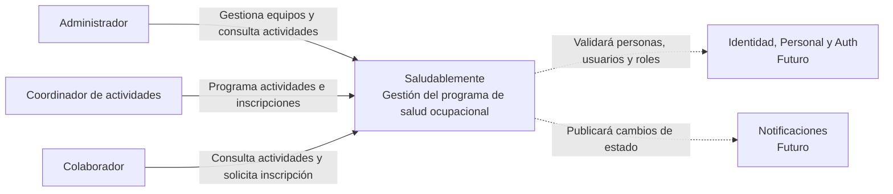
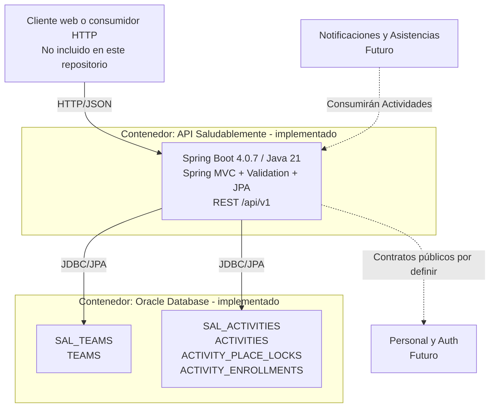
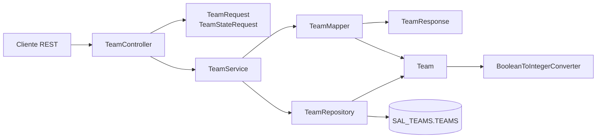
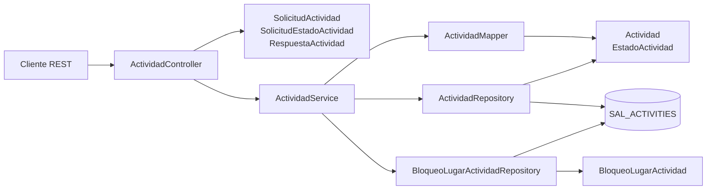
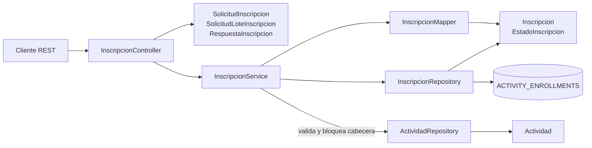
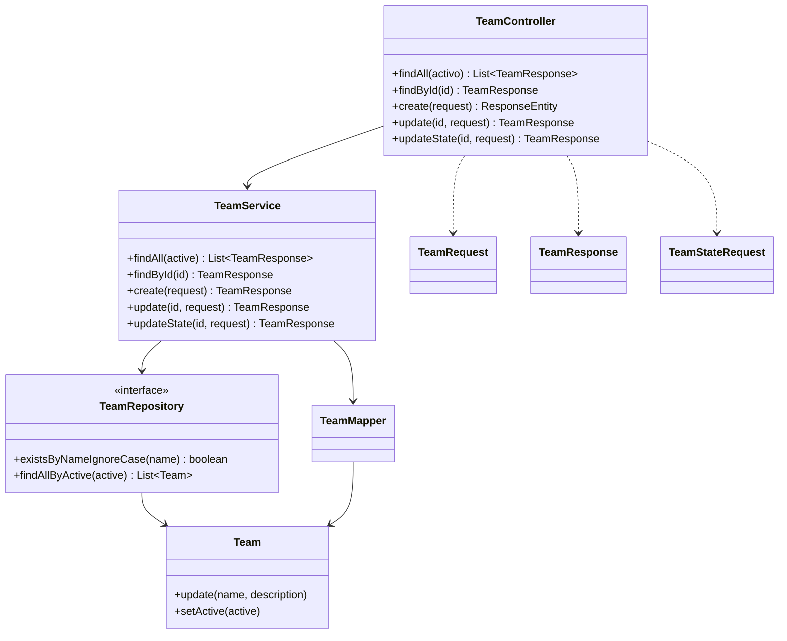
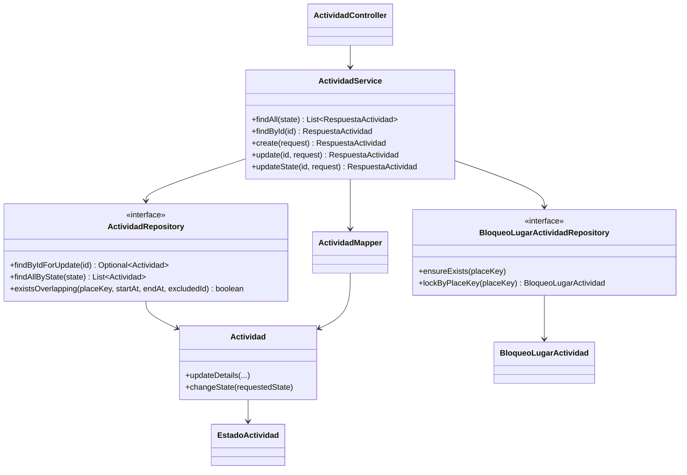
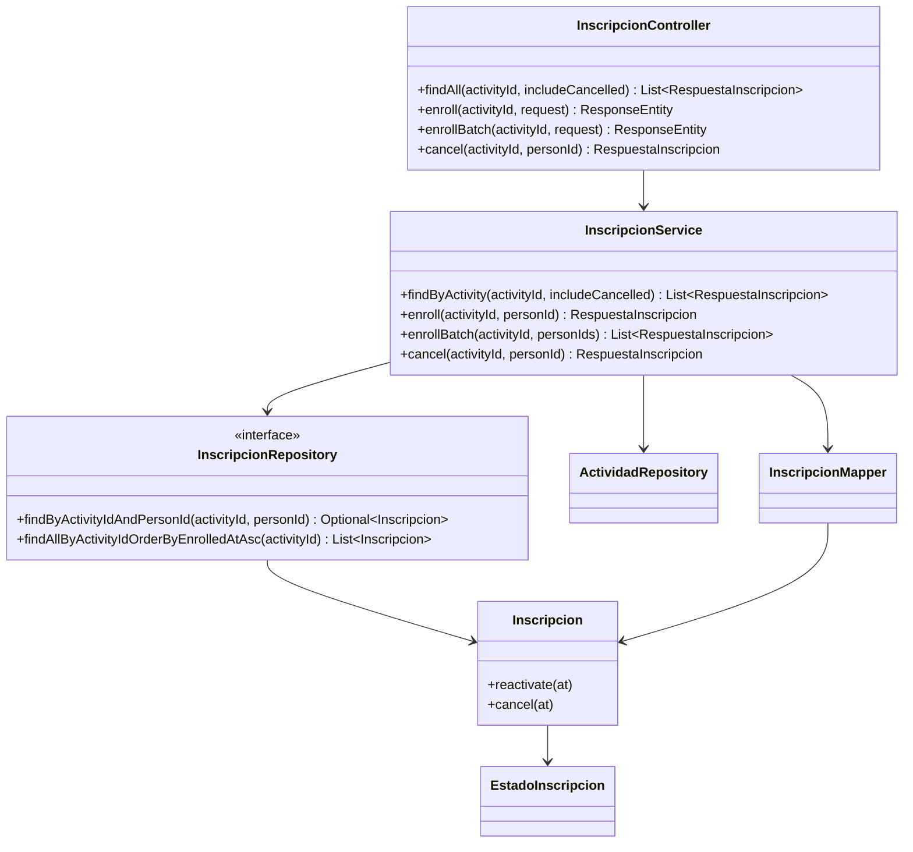

# Modelo C4 de los módulos de Pedro

Este documento presenta la arquitectura académica de Saludablemente con **C1 y C2 como contexto general del proyecto** y **C3 y C4 enfocados en Teams, Actividades e Inscripciones**. Los diagramas distinguen el código existente de las integraciones futuras y están divididos para poder trasladarlos a Miro sin convertirlos en un único gráfico ilegible.

## Convenciones visuales

| Convención | Significado |
|---|---|
| Flecha continua | Relación implementada en el backend actual |
| Flecha punteada | Integración requerida o prevista, todavía no implementada |
| “Futuro” o “no implementado” | Elemento del brief, no componente existente |
| Mismo contenedor Mermaid | Elementos que pertenecen al mismo límite arquitectónico |

## C1 - Contexto del sistema

### Elementos

| Elemento | Tipo | Descripción |
|---|---|---|
| Administrador | Persona | Gestiona equipos y tiene visibilidad general según el brief |
| Coordinador de actividades | Persona | Programa actividades y revisa su participación |
| Colaborador | Persona | Consulta actividades y participa en el programa |
| Saludablemente | Sistema | Centraliza la gestión del programa de salud ocupacional |
| Servicio de identidad institucional | Sistema externo futuro | Proveerá personas, usuarios y roles; no está implementado |
| Servicio de notificaciones | Sistema externo futuro | Recibirá cambios relevantes de actividades; no está implementado |

### Diagrama

**Para Miro:** crear una tarjeta central para Saludablemente, ubicar actores a la izquierda y sistemas externos a la derecha. Usar línea sólida para interacciones actuales y punteada para integraciones futuras.

## C2 - Contenedores

### Elementos

| Elemento | Tipo | Estado | Descripción |
|---|---|---|---|
| Cliente web o consumidor HTTP | Aplicación cliente | Futuro/externo al repositorio | Consume contratos JSON; el frontend no está en este backend |
| API Saludablemente | Aplicación Spring Boot | Implementado | Monolito modular Java 21 con REST, validación, JPA y Spring Modulith |
| Oracle Database | Base de datos | Implementado | Aloja los esquemas físicos `SAL_TEAMS` y `SAL_ACTIVITIES` |
| Personal y Auth | Servicio o módulo | No implementado | Resolverá identidad, estado de persona y autorización |
| Notificaciones y Asistencias | Servicios o módulos | No implementados | Consumirán eventos o contratos de Actividades |

### Diagrama

**Para Miro:** dibujar tres zonas principales —cliente, backend y datos— y una zona lateral gris para integraciones futuras. No colocar Personal/Auth dentro de la API actual hasta que exista implementación.

> El PDF de esquema expresa un modelo lógico con sintaxis MySQL/MariaDB. Los scripts en `database/oracle/` definen la persistencia física vigente del backend.

## C3 - Componentes

C3 detalla los componentes reales dentro del contenedor Spring Boot. `teams` y `actividades` son módulos Spring Modulith; `actividad` e `inscripcion` son subdominios internos de `actividades`.

### C3.1 - Teams

| Elemento | Tipo | Descripción |
|---|---|---|
| `TeamController` | Controller | Adapta `/api/v1/equipos` y respuestas HTTP |
| `TeamRequest`, `TeamStateRequest`, `TeamResponse` | DTO | Definen entrada, estado explícito y salida pública |
| `TeamService` | Servicio de aplicación | Coordina consultas, unicidad, actualización y transacciones |
| `TeamMapper` | Mapper | Normaliza y traduce DTO/entidad |
| `TeamRepository` | Repositorio | Persiste Teams y consulta por nombre/estado |
| `Team` | Entidad | Mantiene nombre, descripción y estado activo |
| `BooleanToIntegerConverter` | Adaptador JPA | Traduce booleano Java a `NUMBER(1)` Oracle |

**Para Miro:** usar una fila Controller -> Service -> Repository -> Oracle. Colocar DTOs junto al Controller y Mapper/Entity debajo del Service.

### C3.2 - Actividades

| Elemento | Tipo | Descripción |
|---|---|---|
| `ActividadController` | Controller | Expone CRUD, filtro y cambio de estado |
| `SolicitudActividad`, `SolicitudEstadoActividad`, `RespuestaActividad` | DTO | Contratos públicos en español |
| `ActividadService` | Servicio de aplicación | Valida horario, normaliza lugar, evita solapamientos y coordina transacciones |
| `ActividadMapper` | Mapper | Traduce fechas/horas y entidad |
| `ActividadRepository` | Repositorio | Consulta estado, bloquea cabecera y detecta solapamiento |
| `BloqueoLugarActividadRepository` | Repositorio técnico | Serializa escrituras por clave normalizada de lugar |
| `Actividad`, `EstadoActividad`, `BloqueoLugarActividad` | Modelo | Entidad, ciclo de vida y fila de coordinación |

**Para Miro:** separar la ruta funcional de Actividad de la coordinación técnica por lugar. El repositorio de bloqueo debe aparecer como soporte de concurrencia, no como módulo independiente.

### C3.3 - Inscripciones

| Elemento | Tipo | Descripción |
|---|---|---|
| `InscripcionController` | Controller | Lista, inscribe individual/lote y cancela lógicamente |
| `SolicitudInscripcion`, `SolicitudLoteInscripcion`, `RespuestaInscripcion` | DTO | Contratos por persona y lote acotado |
| `InscripcionService` | Servicio de aplicación | Valida actividad, lote, duplicados, reactivación y atomicidad |
| `InscripcionMapper` | Mapper | Traduce entidad a respuesta |
| `InscripcionRepository` | Repositorio | Busca por actividad/persona y lista historial |
| `Inscripcion`, `EstadoInscripcion` | Modelo | Conserva estado y fechas sin borrado físico |
| `ActividadRepository` | Colaborador interno | Bloquea la actividad cabecera y verifica su estado |

**Para Miro:** resaltar que `ActividadRepository` es una colaboración interna del mismo módulo `actividades`. No dibujar Inscripciones como Asistencias: son responsabilidades distintas.

## C4 - Código

C4 usa únicamente clases existentes. Las vistas están separadas por subdominio para que métodos y dependencias sigan siendo legibles.

### C4.1 - Teams

| Clase | Estereotipo | Operaciones relevantes |
|---|---|---|
| `TeamController` | `@RestController` | `findAll`, `findById`, `create`, `update`, `updateState` |
| `TeamService` | `@Service` | Casos de uso y límites `@Transactional` |
| `TeamRepository` | Interfaz Spring Data | Búsqueda por estado y comprobación de nombre |
| `TeamMapper` | `@Component` | `toEntity`, `toResponse`, `updateEntity` |
| `Team` | `@Entity` | `update`, `setActive` |

**Para Miro:** convertir cada clase en una tarjeta UML; mostrar solo las operaciones que explican el caso de uso y ocultar getters/constructores.

### C4.2 - Actividades

| Clase | Estereotipo | Operaciones relevantes |
|---|---|---|
| `ActividadController` | `@RestController` | Lista, consulta, crea, actualiza y cambia estado |
| `ActividadService` | `@Service` | `create`, `update`, `updateState`, validación de agenda |
| `ActividadRepository` | Interfaz Spring Data | `findByIdForUpdate`, `findAllByState`, `existsOverlapping` |
| `BloqueoLugarActividadRepository` | Interfaz Spring Data | `ensureExists`, `lockByPlaceKey` |
| `Actividad` | `@Entity` | `updateDetails`, `changeState` |

**Para Miro:** colocar el lock por lugar como una rama de infraestructura del servicio; no mezclarlo con el ciclo de estados de la entidad.

### C4.3 - Inscripciones

| Clase | Estereotipo | Operaciones relevantes |
|---|---|---|
| `InscripcionController` | `@RestController` | `findAll`, `enroll`, `enrollBatch`, `cancel` |
| `InscripcionService` | `@Service` | Casos de uso y validación de cabecera programada |
| `InscripcionRepository` | Interfaz Spring Data | Búsqueda única y listas por actividad/estado |
| `InscripcionMapper` | `@Component` | `toResponse` |
| `Inscripcion` | `@Entity` | `reactivate`, `cancel` |

**Para Miro:** destacar con un color diferente la dependencia a `ActividadRepository`, porque explica la regla cabecera-detalle y el bloqueo antes de modificar inscripciones.

## Fuentes verificadas

- `docs/project-architecture.md` y `docs/pedro-module-roadmap.md`.
- Código en `src/main/java/pe/edu/upeu/saludablemente/teams` y `src/main/java/pe/edu/upeu/saludablemente/actividades`.
- Pruebas equivalentes bajo `src/test/java/pe/edu/upeu/saludablemente/`.
- Brief y esquema lógico entregados por el equipo; material del docente usado como referencia pedagógica, no como instrucción ejecutable.
