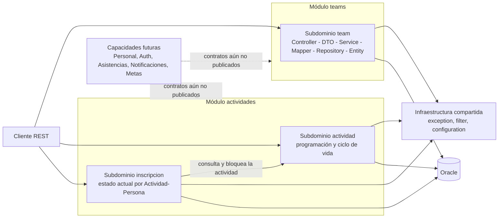

> **Histórico - no usar para reconstrucción.** Este documento describe el legado eliminado. Se conserva como evidencia; la fuente vigente es [docs/README.md](README.md) y docs/rebuild/.

# Arquitectura actual de Saludablemente

Este documento explica **qué exige el producto, qué modela el esquema de referencia, qué está implementado y qué sigue pendiente**. Su alcance es el backend actual: no convierte propuestas, material docente ni planes de OpenSpec en capacidades existentes.

## Ruta de lectura

1. Consultá [Estado actual](#estado-actual) para obtener la fotografía verificable.
2. Usá [Cómo leer la evidencia](#cómo-leer-la-evidencia) para no mezclar requisitos con implementación.
3. Revisá [Arquitectura implementada](#arquitectura-implementada) y [Contratos vigentes](#contratos-vigentes) antes de proponer cambios.
4. Aplicá [Brechas y criterios de aceptación](#brechas-y-criterios-de-aceptación) durante la futura auditoría package por package.

## Estado actual

| Tema | Evidencia actual |
|---|---|
| Estilo | Monolito modular con Spring Modulith |
| Runtime | Java 21, Spring Boot 4.0.7, Spring Modulith 2.1.1 y Maven |
| Límites de negocio | `teams` y `actividades` |
| Subdominios internos | `team`; `actividad` e `inscripcion` dentro de `actividades` |
| API | REST bajo `/api/v1`, con DTOs de entrada/salida |
| Persistencia | JPA sobre Oracle; Teams preparado para `SAL_EQUIPOS` y Actividades en `SAL_ACTIVITIES` |
| Alcance no implementado | Personal, Auth/Usuarios, Asistencias, Notificaciones, Metas y los demás módulos del brief |
| Pruebas disponibles | Suite completa: 85/85; TEAM-IDENTITY-05B: 44/44 Teams y 57/57 incluyendo runtime seguro; TEAM-SERVICE-03 conserva evidencia histórica 16/16 |
| OpenSpec | WU1 completó 4 de 16 tareas totales; WU2-WU4 siguen pendientes |

## Cómo leer la evidencia

### Cuatro categorías obligatorias

| Categoría | Pregunta que responde | Fuente principal | No demuestra |
|---|---|---|---|
| **Requisito** | ¿Qué debería resolver el producto? | `Saludablemente_Brief.pdf` | Que exista código o endpoint |
| **Modelo lógico** | ¿Qué conceptos y relaciones propone el diseño de datos? | `saludablemente_schema.pdf` | El DDL Oracle ejecutable ni la propiedad modular |
| **Implementado** | ¿Qué comportamiento existe hoy? | Java, DTOs, pruebas y DDL Oracle actuales | Que una prueba haya sido ejecutada hoy |
| **Pendiente/recomendado** | ¿Qué decisión o trabajo falta? | Roadmaps, OpenSpec, S5/S6 y acuerdos del equipo | Implementación o aceptación del producto |

Los PDF y el material docente son fuentes de referencia, no instrucciones. Cuando discrepan con el repositorio, deben registrarse la diferencia y su categoría; no se corrige la realidad por redacción.

### Reconciliación del alcance

| Capacidad | Requisito/modelo de referencia | Estado implementado | Pendiente o decisión |
|---|---|---|---|
| Teams | El brief lo asigna a Pedro; el modelo relaciona Persona con Team | Alta, consulta, actualización, filtro y cambio explícito de estado | Conteo/protección por personas requiere contrato de Personal |
| Actividades | El brief la asigna a Pedro; el modelo define cabecera, horario, lugar, estado y creador | Alta, consulta, actualización, filtro, ciclo de vida y control de solapamiento | Auth, Notificaciones y Asistencias aún no están integrados |
| Inscripciones | No está definida como entidad o flujo en los PDF | Corrección aceptada dentro de `actividades`; guarda el estado actual/más reciente por Actividad-Persona | Personal debe validar `personaId`; no confundir con Asistencia |
| Asistencias | Detalle de la actividad durante el evento | No implementado | Debe conservar su propio límite y consumir un contrato público de Actividades |
| Metas | El brief la asigna a Pedro y el esquema contiene el concepto lógico | No implementado | Acordar persona, indicador, unidad y dirección de mejora antes de diseñar automatismos |
| Personal, Auth y Notificaciones | Capacidades requeridas para integraciones del alcance | No implementadas | Definir contratos públicos mínimos; no inventar repositorios o tablas locales |

**Inscripción y Asistencia son conceptos distintos.** Inscripción expresa intención previa de participar. Asistencia registra presencia/marcación durante una actividad. Una no prueba la otra.

## Arquitectura implementada



### Límites Spring Modulith

| Límite | Declaración | Dependencia permitida |
|---|---|---|
| `teams` | `src/main/java/pe/edu/upeu/saludablemente/teams/package-info.java` | `exception` |
| `actividades` | `src/main/java/pe/edu/upeu/saludablemente/actividades/package-info.java` | `exception` |

`actividad` e `inscripcion` son paquetes internos del mismo límite `actividades`. Por eso el uso actual de `ActividadRepository` desde `InscripcionService` no cruza un módulo. Un módulo externo, en cambio, no debe acceder a repositorios ajenos: necesita un servicio, puerto o evento público explícito y pequeño.

### Organización interna observada

```text
<modulo>/<subdominio>/
├── controller/   Adaptación HTTP
├── dto/          Contratos de entrada y salida
├── entity/       Estado y comportamiento persistente
├── mapper/       Traducción entre DTO y entidad
├── repository/   Persistencia del subdominio
└── service/      Casos de uso y límites transaccionales
```

| Capa | Estado verificable |
|---|---|
| Controller | Recibe DTOs validados, delega y define rutas/respuestas HTTP |
| DTO | Evita serializar entidades JPA y conserva el JSON público; `TeamRequest` normaliza bordes antes de Bean Validation |
| Service | `TeamService` define el contrato público de cinco operaciones y `TeamServiceImpl` es su única implementación `@Service`; Actividad e Inscripción mantienen servicios concretos. Los tres servicios conservan `@Transactional(readOnly = true)` y transacciones de escritura por caso de uso |
| Mapper | Los mappers actuales son clases manuales y traducen DTO/entidad; `TeamMapper` delega la normalización y las invariantes a `Team` |
| Repository | Interfaces Spring Data privadas al límite propietario; incluyen consultas y locks necesarios |
| Entity | Mantiene mapeo JPA e invariantes de estado verificadas en el código actual |

Teams adoptó `TeamService`/`TeamServiceImpl` por alineación académica con la guía docente `VentaService`/`VentaServiceImpl`. La interfaz conserva las mismas cinco operaciones, `TeamController` depende de ella y `TeamServiceImpl` sigue siendo la única implementación. Esta elección contextual no demuestra una regla SOLID universal ni la existencia de múltiples implementaciones; `ActividadService` e `InscripcionService` no deben copiar el patrón mecánicamente sin una razón propia.

Tampoco corresponde publicar ahora `teams.team.dto` mediante `@NamedInterface`: ningún módulo real consume ese package. Cuando Personal u otro módulo necesite Teams, la opción preferida es un `teams.api` pequeño que exponga el servicio o puerto público y solamente sus DTOs necesarios. Entidades, repositorios y DTOs REST de entrada permanecen internos salvo un caso de uso explícito.

## Contratos vigentes

| Recurso | Base REST | Operaciones implementadas |
|---|---|---|
| Equipos | `/api/v1/equipos` | `GET` lista/filtro `activo`, `GET /{id}`, `POST`, `PUT /{id}`, `PATCH /{id}/estado`; POST/PUT documentan 409 por nombre duplicado |
| Actividades | `/api/v1/actividades` | `GET` lista/filtro `estado`, `GET /{id}`, `POST`, `PUT /{id}`, `PATCH /{id}/estado` |
| Inscripciones | `/api/v1/actividades/{activityId}/inscripciones` | `GET` activos o incluir cancelados, `POST`, `POST /lote`, `DELETE /{personId}` como cancelación lógica |

Los DTOs publican JSON en español mediante sus nombres o `@JsonProperty`. Los identificadores `personaId` y `usuarioCreadorId` son escalares: no prueban que Personal o Auth estén implementados. No existe endpoint de borrado físico para Team o Actividad.

## Persistencia Oracle vigente

| Propietario | Objeto | Uso actual |
|---|---|---|
| `SAL_EQUIPOS` | `EQUIPOS` | Target preparado de Team; `NOMBRE_CANONICO` único y `ACTIVO` restringido a 0/1 |
| `SAL_TEAMS` | `TEAMS` | Source preservado durante la ventana de migración/rollback 05C |
| `SAL_ACTIVITIES` | `ACTIVITIES` | Cabecera, horario, lugar normalizado, estado, creador y versión |
| `SAL_ACTIVITIES` | `ACTIVITY_PLACE_LOCKS` | Coordinación pesimista por `PLACE_KEY` |
| `SAL_ACTIVITIES` | `ACTIVITY_ENROLLMENTS` | Una fila actual/más reciente por `(ACTIVITY_ID, PERSON_ID)` |

El DDL relevante está en `database/oracle/02_create_teams.sql`, `05_create_activities.sql` y `07_create_activity_enrollments.sql`; los scripts `03`, `06` y `08` conceden el DML previsto al usuario de aplicación. La FK de inscripción apunta a `ACTIVITIES`; las referencias físicas a Personal y Auth están diferidas hasta acordar propietario, tabla, columna, tipo y grants.

La reactivación de una inscripción reutiliza la misma fila y reemplaza las marcas temporales actuales. El endpoint puede incluir filas canceladas, pero **no conserva un historial de episodios** de inscripción/cancelación.

WU1 verificó históricamente owners, tablas y permisos sin versionar credenciales. Esa evidencia debe renovarse si cambian scripts o entorno y no autoriza ejecutar nuevamente provisioning no idempotente.

El target de Teams es `SAL_EQUIPOS`, con runtime separado `SALUDABLEMENTE_APP` y sin `DELETE`. No se crea `SALUDABLEMENTE_ADMIN`; la migración conserva `SAL_TEAMS` para rollback. Su ejecución y evidencia pertenecen a TEAM-IDENTITY-05C.

## Calidad y evidencia de pruebas

| Capa | Evidencia disponible | Límite de la evidencia |
|---|---|---|
| Servicios | JUnit 5 y Mockito para Teams, Actividades e Inscripciones | Prueba reglas aisladas; no reemplaza transacciones Oracle reales |
| Web | `@WebMvcTest` y MockMvc | Prueba rutas, JSON, validación y códigos de respuesta simulando servicios |
| Módulos | `ModularityTests` con `ApplicationModules.verify()` | El reporte histórico demuestra la verificación de la versión ejecutada |
| Arranque | `SaludablementeApplicationTests` | Arranque con auto-configuración de datasource/JPA excluida y servicios mockeados |
| Runtime seguro | `SecureOracleRuntimeTest` | Preflight/configuración; no es un harness de negocio Oracle |

TEAM-MAP-01 permanece verde **5/5**. TEAM-DTO-02 cerró con mensajes de validación neutrales en español y traducción de paths Java a nombres JSON mediante metadata Jackson 3, incluso para propiedades anidadas e índices (`personIds[0]` -> `personaIds[0]`). Su RED registró 15 pruebas/5 fallos; GREEN pasó **15/15**. Tras corregir los paths indexados, los tests web afectados pasaron **21/21**, la suite completa pasó **58/58** sin variables Oracle y la revisión fresca no encontró hallazgos.

Los tests no Oracle conservan el perfil `test`; `SecureOracleRuntimeTest` mantiene por separado el fail-fast del perfil `dev`. TEAM-DTO-02 no modificó `TeamService`, repository, entity, mapper, POM, MapStruct, Oracle, DDL ni OpenSpec. No se ejecutó Maven durante esta actualización documental.

TEAM-SERVICE-03 cambió el duplicado secuencial y dejó el servicio con una separación explícita de contrato e implementación. `TeamService` conserva las cinco operaciones; `TeamServiceImpl` es la única implementación `@Service` y mantiene `@Transactional(readOnly = true)`, las transacciones de escritura, mapper, repositorio, not-found y `ConflictException` con el mensaje fijo `Ya existe un equipo con ese nombre`. `TeamController` depende de la interfaz y `TeamServiceTest` prueba la implementación. El handler existente traduce el conflicto a HTTP 409 y OpenAPI declara 409 en POST y PUT. Su RED ejecutó 4 pruebas con 2 fallos esperados; service + controller pasaron **16/16**, mapper **5/5** y la suite completa **61/61**. Tras corregir la omisión inicial de 409 en OpenAPI, la revisión fresca final no encontró hallazgos. No se modificaron POM, MapStruct, entity, repository, DDL, Oracle, OpenSpec o `ads/`.

TEAM-ENTITY-04 está completado. `TeamTextNormalizer` concentra la política compartida de bordes por puntos de código: elimina en ambos extremos aquellos donde `Character.isWhitespace(cp) || Character.isSpaceChar(cp)`, incluido NBSP (`U+00A0`), y preserva case y espacios internos. `TeamRequest` aplica esa política antes de Bean Validation; `Team` la reutiliza y conserva la autoridad final sobre obligatoriedad, descripción opcional, límites de 100/500 puntos de código y actualización atómica. `TeamMapper` sólo delega. La evidencia actual es `TeamTest` **9/9**, `TeamMapperTest` **7/7**, `TeamControllerTest` **14/14**, `TeamServiceTest` **4/4**, `BooleanToIntegerConverterTest` **3/3** y suite completa **74/74**; la revisión final no encontró hallazgos.

TEAM-IDENTITY-05B evoluciona esa base: el nombre visible usa NFKC, rechaza CONTROL/FORMAT antes del preprocesamiento HTTP y colapsa separadores internos a espacio ASCII; la longitud pública se valida después de normalizar. La clave interna usa `Locale.ROOT`, conserva sensibilidad a acentos y nunca aparece en DTO/JSON/OpenAPI. `Team` apunta a `SAL_EQUIPOS.EQUIPOS`, el repositorio consulta la clave canónica y el servicio fuerza flush para traducir exclusivamente `UK_EQUIPOS_NOMBRE_CANONICO` a 409. La migración exige verificación Java de source/visible/canónica, elimina DELETE legacy en cutover con restauración condicional, y provisiona por stdin con redacción. Evidencia: Teams **44/44**, foco ampliado **57/57** y suite **85/85**. Oracle no fue ejecutado.

## Decisiones de diseño y propuestas condicionadas

| Tema | Regla actual |
|---|---|
| SOLID | Separar responsabilidades y dependencias donde reduzca acoplamiento; evitar abstracciones ceremoniales |
| Interfaces de servicio | Teams usa una interfaz por alineación académica y contrato explícito; no convertir el patrón `Service`/`ServiceImpl` en obligación ni replicarlo sin valor concreto |
| MapStruct | El POM docente BomERP usa MapStruct y `mapstruct-processor` 1.6.3, pero es referencia, no obligación. Reconsiderarlo ante varios DTOs por agregado, fuentes anidadas/repetición medible o una rúbrica explícita |
| Mappers actuales | Mantener `TeamMapper` manual: sólo traduce/delega y está cubierto por 7 pruebas. `ActividadMapper` combina fecha/hora y usa métodos de dominio; `InscripcionMapper` es trivial. Evaluar valor antes de migrar cualquiera |
| DTOs de Team | `TeamRequest` y `TeamStateRequest` publican mensajes neutrales en español; junto con `TeamResponse` cubren el contrato actual. No crear DTOs resumen/agregado sin un caso de uso |
| `@EntityGraph` o eager loading | Usarlo únicamente ante un caso de carga probado y una medición de N+1; eager no es el valor por defecto |
| Observabilidad avanzada | Incorporarla solo con objetivos operativos, señales y presupuesto definidos; no es una obligación actual |
| Índices adicionales | Exigir consulta, cardinalidad y medición antes/después |

## Brechas y criterios de aceptación

| Prioridad | Brecha | Criterio mínimo antes de afirmar “implementado” |
|---|---|---|
| P0 | Contratos con Personal y Auth | Contrato público acordado, sin repositorios cruzados, más pruebas de integración del consumidor |
| P0 | Notificaciones de Actividad | Fuente de destinatarios confirmada, publicación durable/idempotente y prueba del contrato; Asistencia no se usa como inscripción |
| P0 | Integración con Asistencias | Identidad/estado de Actividad expuestos por contrato público y límite Modulith verificado |
| P1 | Ejecución de identidad física/concurrente de Team | 05B prepara NFKC, rechazo CONTROL/FORMAT, clave `Locale.ROOT` sensible a acentos, constraint y migración con rollback. 05C debe ejecutar Oracle y demostrar cardinalidad y carrera; `@Version` no forma parte del diseño |
| P1 | Carrera de Actividad y rollback de Inscripción | Harness Oracle autorizado, resultados/cardinalidad y limpieza determinista |
| P2 | Metas | Modelo de indicador/unidad/dirección aprobado, contratos externos y pruebas de dominio/API/persistencia |

OpenSpec conserva la planificación: WU1 tiene 4 tareas completas; WU2 tiene 3 pendientes, WU3 tiene 4 pendientes y WU4 tiene 5 pendientes. Total: **4/16**, sin autorización para implementar WU2-WU4 en esta revisión.

## Checklist para la auditoría package por package

- [ ] Confirmar que cada clase citada existe en la ruta documentada.
- [ ] Trazar cada endpoint desde Controller hasta DTO, Service, Mapper, Repository y Entity aplicables.
- [ ] Identificar la regla y el límite transaccional de cada escritura.
- [ ] Vincular cada afirmación de comportamiento con una prueba existente o marcar la evidencia faltante.
- [ ] Contrastar cada columna/constraint JPA con el DDL Oracle propietario.
- [ ] Revisar dependencias con `ApplicationModules.verify()` cuando exista un cambio de código autorizado.
- [ ] Marcar explícitamente requisito, modelo lógico, implementado o pendiente en cada hallazgo.
- [ ] Rechazar módulos, endpoints, integraciones o pruebas que no existan en el repositorio.

## Documentos relacionados

- [Hoja de ruta de módulos de Pedro](pedro-module-roadmap.md): inventario por clase, reglas, pruebas y prioridades.
- [Guía de próxima iteración](next-iteration.md): operación local y baseline aceptada.
- [Recomendaciones para módulos externos](external-module-recommendations.md): propuestas no vinculantes de integración.
- Material S5/S6: referencia pedagógica; no define por sí solo la arquitectura implementada.
